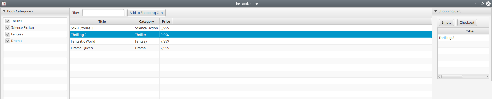
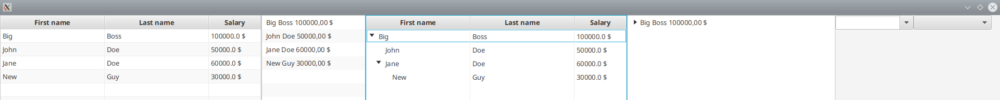

# Module "actionfx-app-sample"

This module contains application sample with and without Spring as bean container.

Module | Description | API Documentation | Gradle Dependency 
------ | ----------- | ----------------- | ----------
[actionfx-app-sample](README.md) | This module contains small sample applications how to use ActionFX with the default bean container using just the actionfx-core module and how to use it with a Spring bean container. | [Javadoc](https://martinkoster.github.io/actionfx/actionfx-app-sample/index.html) | -

This module contains the following demo applications:

- [A Simple Book Store](#a-simple-book-store): A FXML-based demo showing most of the annotations available in ActionFX. The application has a main class for getting started via ActionFX's core bean container and a main class for getting starting with Spring Boot.
- [Datacontainer Demo](#data-container-demo): A statically-coded view demo showing data container configurations for `TableView`, `TreeTableView`, `TreeView`, `ListView`, `ChoiceBox` and `ComboBox`.

## A Simple Book Store

The sample application features a simple book store, where you can browse a book catalogue (including filtering) and add books to a shopping cart. The demo ends with a modal check-out dialogue.

The application itself can be run inside ActionFX default bean container without Spring or alternatively inside a Spring container. 

For this simple application, we can use exactly the same application code. However, it is differently started from within different main application classes (refer to source code samples below). Using the same application code with and without Spring is possible in this case, because we only use Spring's dependency injection mechanism using the annotation `javax.inject.Inject` inside controller classes, which is understood by both ActionFX' default bean container and Spring.

As a further demo case, the sample application leverages ControlsFX' `org.controlsfx.control.CheckListView` for selecting book categories to display.



### Starting the application with ActionFX' default bean container

For using ActionFX' default bean container, we derive our JavaFX class from [AbstractAFXApplication](../actionfx-core/src/main/java/com/github/actionfx/core/app/AbstractAFXApplication.java).

With the annotation [@AFXApplication](../actionfx-core/src/main/java/com/github/actionfx/core/annotation/AFXApplication.java), we define the root package name for scanning for controllers and the main view to display after application startup.

```java
public class BookstoreAppWithDefaultBeanContainer {

	public static void main(final String[] argv) {
		Application.launch(SampleActionFXApplication.class);
	}

	@AFXApplication(mainViewId = "mainView", scanPackage = "com.github.actionfx.bookstoreapp.controller")
	public static class SampleActionFXApplication extends AbstractAFXApplication {

	}
}
```
Source Code can be found here: [BookstoreAppWithDefaultBeanContainer](src/main/java/com/github/actionfx/bookstoreapp/core/app/BookstoreAppWithDefaultBeanContainer.java)


### Starting the application with the Spring bean container

In case we want to run our book application in a Spring container, we need to setup our `ActionFX` application instance in the `main` method. We use the configuration class `SampleActionFXApplication` which holds again the `@AFXApplication`  annotation defining the package to scan for ActionFX controller and the main view.
 
```java
@SpringBootApplication
public class BookstoreAppWithSpringBeanContainer {

	public static void main(final String[] argv) {
		ActionFX.builder().configurationClass(SampleActionFXApplication.class).build();
		Application.launch(SampleActionFXApplication.class);
	}

	@AFXApplication(mainViewId = "mainView", scanPackage = "com.github.actionfx.bookstoreapp.controller")
	public static class SampleActionFXApplication extends Application {

		@Override
		public void init() throws Exception {
			SpringApplication.run(MainAppWithSpringBeanContainer.class);
		}

		@Override
		public void start(final Stage primaryStage) throws Exception {
			ActionFX.getInstance().displayMainView(primaryStage);
		}
	}
}
```

The class `SampleActionFXApplication` is derived from JavaFX `javafx.application.Application` which provides the `init` and `start` methods to override for our demo application.
 
In the `init` method, we start the Spring container. Please remember that `init` is not called from inside the JavaFX-thread. ActionFX however is interacting the JavaFX-thread to initialize its controllers in the JavaFX thread (there are view components like `javafx.scene.web.WebView` that can only be instantiated inside the JavaFX thread).

In the `start` method, we use the supplied `primaryStage` to display the main view inside by calling `ActionFX.getInstance().displayMainView(primaryStage)`.

Source Code can be found here: [BookstoreAppWithSpringBeanContainer](src/main/java/com/github/actionfx/bookstoreapp/spring/app/BookstoreAppWithSpringBeanContainer.java)

### The Controller and Views

The following sections describe all controller and view for the demo book application.

#### MainController

The main controller glues together the different views that are relevant for the book store application: the book catalogue and the shopping cart.

By using the `@AFXNestedView` annotation, we attach the views into the annotated field of type `javafx.scene.layout.BorderPane`.

```java
@AFXController(viewId = "mainView", fxml = "/fxml/MainView.fxml", maximized = true, icon = "/images/book.png", title = "The Book Store")
public class MainController {

	@AFXNestedView(refViewId = "bookCatalogueView", attachToBorderPanePosition = BorderPanePosition.CENTER)
	@AFXNestedView(refViewId = "shoppingCartView", attachToBorderPanePosition = BorderPanePosition.RIGHT)
	@FXML
	private BorderPane contentPane;

}
```

Source Code can be found here: [MainController](src/main/java/com/github/actionfx/bookstoreapp/controller/MainController.java)

#### BookCatalogueController

The book catalogue controller allows to browse books, filtered by a book category and by an additional title filter text.

```java
@AFXController(viewId = "bookCatalogueView", fxml = "/fxml/BookCatalogueView.fxml")
public class BookCatalogueController {

	@FXML
	private CheckListView<String> categoriesCheckListView;

	@AFXUseFilteredList
	@AFXEnableMultiSelection
	@AFXCellValueConfig(colId = "titleColumn", propertyValue = "title")
	@AFXCellValueConfig(colId = "categoryColumn", propertyValue = "category")
	@AFXCellValueConfig(colId = "priceColumn", propertyValue = "price", stringConverter = DoubleCurrencyStringConverter.class)
	@FXML
	private TableView<Book> bookTableView;

	// both, ActionFX' BeanContainer and Spring bean container know how to interpret
	// this annotation
	@Inject
	private ShoppingCartController shoppingCartController;

	@PostConstruct
	public void initialize() {
		categoriesCheckListView.getCheckModel().checkAll();
	}

	@AFXLoadControlData(controlId = "categoriesCheckListView")
	public List<String> loadCategories() {
		return Arrays.asList("Thriller", "Science Fiction", "Fantasy", "Drama");
	}

	@AFXLoadControlData(controlId = "bookTableView", async = true)
	public List<Book> loadBooks() {
		final List<Book> books = new ArrayList<>();
		books.add(new Book("Sci-Fi Stories 3", "Science Fiction", 8.99));
		books.add(new Book("Thrilling 2", "Thriller", 9.99));
		books.add(new Book("Fantastic World", "Fantasy", 7.99));
		books.add(new Book("Drama Queen", "Drama", 2.99));
		return books;
	}

	/**
	 * Immediately fired after the user changes the selection in the
	 * "categoryCheckListView".
	 *
	 * @param selectedCategories the selected categories
	 * @param filterText         the entered filter text (from the control
	 *                           "filterTextField")
	 */
	@AFXOnControlValueChange(controlId = "categoriesCheckListView")
	public void onCategoryChange(final List<String> selectedCategories,
			@AFXControlValue("filterTextField") final String filterText) {
		applyPredicate(filterText, selectedCategories);
	}

	/**
	 * Triggered 400ms after the user typed something in the filter text field.
	 *
	 * @param filterText         the entered filter text
	 * @param selectedCategories the selected categories (from control
	 *                           "categoriesCheckListView")
	 */
	@AFXOnControlValueChange(controlId = "filterTextField", timeoutMs = 400)
	public void onFilterChange(final String filterText,
			@AFXControlValue("categoriesCheckListView") final List<String> selectedCategories) {
		applyPredicate(filterText, selectedCategories);
	}

	/**
	 * Fired when the user clicks on button "Add to Shopping Cart". The selected
	 * books are retrieved from control "bookTableView".
	 *
	 * @param selectedBooks the selected books from control "bookTableView"
	 */
	@AFXOnAction(controlId = "addToShoppingCartButton")
	public void addToShoppingCart(@AFXControlValue("bookTableView") final List<Book> selectedBooks) {
		shoppingCartController.addToShoppingCart(selectedBooks);
	}

	/**
	 * Constructs and applies a predicate for filtering books.
	 *
	 * @param filterText         the filter text to be applied on the title
	 * @param selectedCategories the categories
	 * @return
	 */
	public void applyPredicate(final String filterText, final List<String> selectedCategories) {
		final Predicate<Book> p = b -> selectedCategories.contains(b.getCategory());
		final FilteredList<Book> filteredList = (FilteredList<Book>) bookTableView.getItems();
		filteredList.setPredicate(p.and(b -> b.getTitle().toLowerCase().contains(filterText.toLowerCase())));
	}
}
```

The catalogue view holds a ControlsFX `CheckListView` which displays the categories. This control is filled with data from the corresponding method annotated by `@AFXLoadControlData(controlId = "categoriesCheckListView")`:

```java
	@AFXLoadControlData(controlId = "categoriesCheckListView")
	public List<String> loadCategories() {
		...
	}
```

The actual books are displayed in a `javafx.scene.layout.TableView` which is configured to support a multi-selection and a filtering. Additionally, it is configured, which data is displayed in which column via the `AFXCellValueConfig` annotation:

```java
	@AFXUseFilteredList
	@AFXEnableMultiSelection
	@AFXCellValueConfig(colId = "titleColumn", propertyValue = "title")
	@AFXCellValueConfig(colId = "categoryColumn", propertyValue = "category")
	@AFXCellValueConfig(colId = "priceColumn", propertyValue = "price", stringConverter = DoubleCurrencyStringConverter.class)
	@FXML
	private TableView<Book> bookTableView;
```
In plain JavaFX, it would be required to inject the `TableColumn` instances via `@FXML`. In ActionFX, this is not required as the table column instances are looked up in the scene graph using the `colId` attribute in `@AFXCellValueConfig`.

The table view itself is loaded in an asynchronous fashion via:

```java
	@AFXLoadControlData(controlId = "bookTableView", async = true)
	public List<Book> loadBooks() {
		...
	}
```

In a real application, loading can be performed from e.g. a data base. By using asynchronous, non-blocking loading of books, the UI of our application will not freeze.

Now for the actions that are possible inside the UI:

First, we can filter books by selecting/deselecting a book category in the ControlsFX `CheckListView`. Therefore, we define the following callback method, where we also additionally consider a potential filtering text on the book title by using annotation `@AFXControlValue` referring to the text field holding the filter text (category filter and title filter are applied both in a logical "AND" fashion):

```java
	@AFXOnControlValueChange(controlId = "categoriesCheckListView")
	public void onCategoryChange(final List<String> selectedCategories,
			@AFXControlValue("filterTextField") final String filterText) {
		...
	}
```

Second, we can filter books by the aforementioned title filter. Therefore, we define the following callback method, where we also consider the potential category filter, referred to by annotation `@AFXControlValue`:

```java
	@AFXOnControlValueChange(controlId = "filterTextField", timeoutMs = 400)
	public void onFilterChange(final String filterText,
			@AFXControlValue("categoriesCheckListView") final List<String> selectedCategories) {
		...
	}
```

The `@AFXOnControlValueChange` uses attribute `timeoutMs = 400`. This means that the change event is only triggered after 400ms without user interaction typing in the filter text field. This is desired as you might not want to execute the annotated method on every key stroke made by the user.

Last but not least, we define an action method that is invoked when the user wants to add one or multiple books to the shopping cart:

```java
	@AFXOnAction(controlId = "addToShoppingCartButton")
	public void addToShoppingCart(@AFXControlValue("bookTableView") final List<Book> selectedBooks) {
		shoppingCartController.addToShoppingCart(selectedBooks);
	}
```

In this action method, we inject the **currently selected** books from the table view "bookTableView" via annotation `@AFXControlValue("bookTableView")`.

In this step, we simply hand-over all selected books to the shopping cart controller, described in the next section.

Source Code can be found here: [BookCatalogueController](src/main/java/com/github/actionfx/bookstoreapp/controller/BookCatalogueController.java)

#### ShoppingCartController

The shopping cart controller holds functionality for emptying the shopping cart and for performing the check-out process.

```java
@AFXController(viewId = "shoppingCartView", fxml = "/fxml/ShoppingCartView.fxml")
public class ShoppingCartController {

	@FXML
	private Button emptyButton;

	@FXML
	private Button checkoutButton;

	@FXML
	private TableView<Book> bookTableView;

	@FXML
	private TableColumn<Book, String> titleColumn;

	@FXML
	private TableColumn<Book, String> categoryColumn;

	@FXML
	private TableColumn<Book, String> priceColumn;

	@PostConstruct
	public void initialize() {
		titleColumn.setCellValueFactory(new PropertyValueFactory<>("title"));
		categoryColumn.setCellValueFactory(new PropertyValueFactory<>("category"));
		priceColumn.setCellValueFactory(new PropertyValueFactory<>("price"));
	}

	@AFXOnAction(controlId = "emptyButton")
	public void emptyShoppingCart() {
		bookTableView.getItems().clear();
	}

	@AFXOnAction(controlId = "checkoutButton")
	@AFXShowView(viewId = "checkoutView", showInNewWindow = true)
	public void checkout() {
		// no to-do here as of the moment. Displaying of the view is achieved by
		// annotation "AFXShowView"
	}

	public void addToShoppingCart(final List<Book> books) {
		bookTableView.getItems().addAll(books);
	}
}
```

The action for emptying the shopping cart is quite simple and straight-forward by using the `@AFXOnAction` annotation:

```java
	@AFXOnAction(controlId = "emptyButton")
	public void emptyShoppingCart() {
		bookTableView.getItems().clear();
	}
```

For the starting the check-out procedure, we display the check-out dialogue in a new, modal window having its own `javafx.stage.Stage`. For that, we combine the `AFXOnAction` annotation with the `AFXShowView` annotation that opens the defined view with name `checkoutView` is a new window (`showInNewWindow=true`).

```java
	@AFXOnAction(controlId = "checkoutButton")
	@AFXShowView(viewId = "checkoutView", showInNewWindow = true)
	public void checkout() {
		// no to-do here as of the moment. Displaying of the view is achieved by
		// annotation "AFXShowView"
	}
```

Source Code can be found here: [ShoppingCartController](src/main/java/com/github/actionfx/bookstoreapp/controller/ShoppingCartController.java)

#### CheckoutController 

The check-out controller does not contain any logic anymore as it is the end of the demo application.

However, the applied `@AFXController` annotation shows how to display the view as a modal dialog (`modal=true`) at a certain position and in a certain size:

```java
@AFXController(viewId = "checkoutView", fxml = "/fxml/CheckoutView.fxml", icon = "/images/book.png", title = "Check Out", modal = true, width = 600, height = 500, posX = 600, posY = 300)
public class CheckoutController {

}
```

Source Code can be found here: [CheckoutController](src/main/java/com/github/actionfx/bookstoreapp/controller/CheckoutController.java)

## Data Container Demo

This sample application focuses on the configuration of data container controls like `TableView`, `TreeTableView`, `TreeView`, `ListView`, `ChoiceBox` and `ComboBox`. For this, the controller annotations [@AFXCellValueConfig](../actionfx-core/src/main/java/com/github/actionfx/core/annotation/AFXCellValueConfig.java) and [@AFXConverter](../actionfx-core/src/main/java/com/github/actionfx/core/annotation/AFXConverter.java) are used. Additionally, the demo shows how to implement a view directly instead of using FXML (however, FXML should be mostly preferred).



### Starting the application with ActionFX' default bean container

For starting the appplication, we have mostly the same startup class than for the bookstore app, but now pointing at a different package holding the ActionFX controller and views:

```java
public class DatacontainerApp {

	public static void main(final String[] argv) {
		Application.launch(SampleActionFXApplication.class);
	}

	@AFXApplication(mainViewId = "datacontainerDemoView", scanPackage = "com.github.actionfx.datacontainerapp.controller")
	public static class SampleActionFXApplication extends AbstractAFXApplication {

	}

}
```

Source Code can be found here: [DatacontainerApp](src/main/java/com/github/actionfx/datacontainerapp/app/DatacontainerApp.java)

### Coding the Static View 

As mentioned before, in this demo we are not going to use FXML, but we are going to statically code the view (again, FXML should be the preferred way).

```java
public class DatacontainerView extends HBox {

	public DatacontainerView() {
		getChildren().add(createTableView());
		getChildren().add(createListView());
		getChildren().add(createTreeTableView());
		getChildren().add(createTreeView());
		getChildren().add(createComboBox());
		getChildren().add(createChoiceBox());
	}

	@SuppressWarnings("unchecked")
	private TableView<Employee> createTableView() {
		final TableView<Employee> tableView = new TableView<>();
		tableView.setId("employeeTableView");
		final TableColumn<Employee, String> firstNameColumn = new TableColumn<>();
		firstNameColumn.setId("firstNameColumn");
		firstNameColumn.setText("First name");
		firstNameColumn.setPrefWidth(200.0);
		final TableColumn<Employee, String> lastNameColumn = new TableColumn<>();
		lastNameColumn.setText("Last name");
		lastNameColumn.setId("lastNameColumn");
		lastNameColumn.setPrefWidth(200.0);
		final TableColumn<Employee, String> salaryColumn = new TableColumn<>();
		salaryColumn.setId("salaryColumn");
		salaryColumn.setText("Salary");
		salaryColumn.setPrefWidth(100.0);
		tableView.getColumns().addAll(firstNameColumn, lastNameColumn, salaryColumn);
		return tableView;
	}

	private ListView<Employee> createListView() {
		final ListView<Employee> listView = new ListView<>();
		listView.setId("employeeListView");
		listView.setPrefWidth(200.0);
		return listView;
	}

	@SuppressWarnings("unchecked")
	private TreeTableView<Employee> createTreeTableView() {
		final TreeTableView<Employee> tableView = new TreeTableView<>();
		tableView.setId("employeeTreeTableView");
		final TreeTableColumn<Employee, String> firstNameColumn = new TreeTableColumn<>();
		firstNameColumn.setId("firstNameTreeColumn");
		firstNameColumn.setText("First name");
		firstNameColumn.setPrefWidth(200.0);
		final TreeTableColumn<Employee, String> lastNameColumn = new TreeTableColumn<>();
		lastNameColumn.setText("Last name");
		lastNameColumn.setId("lastNameTreeColumn");
		lastNameColumn.setPrefWidth(200.0);
		final TreeTableColumn<Employee, String> salaryColumn = new TreeTableColumn<>();
		salaryColumn.setId("salaryTreeColumn");
		salaryColumn.setText("Salary");
		salaryColumn.setPrefWidth(100.0);
		tableView.getColumns().addAll(firstNameColumn, lastNameColumn, salaryColumn);
		return tableView;
	}

	private TreeView<Employee> createTreeView() {
		final TreeView<Employee> treeView = new TreeView<>();
		treeView.setId("employeeTreeView");
		treeView.setPrefWidth(400.0);
		return treeView;
	}

	private ComboBox<Employee> createComboBox() {
		final ComboBox<Employee> comboBox = new ComboBox<>();
		comboBox.setEditable(true);
		comboBox.setId("employeeComboBox");
		comboBox.setPrefWidth(150);
		return comboBox;
	}

	private ChoiceBox<Employee> createChoiceBox() {
		final ChoiceBox<Employee> choiceBox = new ChoiceBox<>();
		choiceBox.setId("employeeChoiceBox");
		choiceBox.setPrefWidth(150);
		return choiceBox;
	}
}
```

The view class itself needs to be derived from a node that extends from `javafx.scene.Parent`. As you can see, we give relevant nodes an ID, which is required to have them referenced via the `@FXML` annotation in controller shown in the next section.

Source Code can be found here: [DatacontainerView](src/main/java/com/github/actionfx/datacontainerapp/view/DatacontainerView.java)

### Coding the Controller and Configuring the Data Controls

Implementing the controller starts again with using the `@AFXControler` annotation. However instead of using the `fxml()` attribute to point at a FXML file, we use the `viewClass()` attribute and point to our statically coded view class in the section before.

All relevant controls that are configured through ActionFX are injected via the `@FXML` annotation. Although we did not use FXML markup to define the view, this works because we gave each relevant control an `id` in the view class.

```java
@AFXController(viewId = "datacontainerDemoView", viewClass = DatacontainerView.class, maximized = true)
public class DatacontainerController {

	@AFXCellValueConfig(colId = "firstNameColumn", propertyValue = "firstName")
	@AFXCellValueConfig(colId = "lastNameColumn", propertyValue = "lastName")
	@AFXCellValueConfig(colId = "salaryColumn", propertyValue = "salary", stringConverter = DoubleCurrencyStringConverter.class)
	@FXML
	private TableView<Employee> employeeTableView;

	@AFXCellValueConfig(stringConverter = EmployeeStringConverter.class)
	@FXML
	private ListView<Employee> employeeListView;

	@AFXCellValueConfig(colId = "firstNameTreeColumn", propertyValue = "firstName")
	@AFXCellValueConfig(colId = "lastNameTreeColumn", propertyValue = "lastName")
	@AFXCellValueConfig(colId = "salaryTreeColumn", propertyValue = "salary", stringConverter = DoubleCurrencyStringConverter.class)
	@FXML
	private TreeTableView<Employee> employeeTreeTableView;

	@AFXCellValueConfig(stringConverter = EmployeeStringConverter.class)
	@FXML
	private TreeView<Employee> employeeTreeView;

	@AFXConverter(EmployeeStringConverter.class)
	@FXML
	private ComboBox<Employee> employeeComboBox;

	@AFXConverter(EmployeeStringConverter.class)
	@FXML
	private ChoiceBox<Employee> employeeChoiceBox;

	@AFXLoadControlData(controlId = "employeeTableView")
	public List<Employee> loadEmployeeTableData() {
		return Arrays.asList(new Employee("Big", "Boss", 100000.0), new Employee("John", "Doe", 50000.0),
				new Employee("Jane", "Doe", 60000.0), new Employee("New", "Guy", 30000.0));
	}

	@AFXLoadControlData(controlId = "employeeListView")
	public List<Employee> loadEmployeeListData() {
		return loadEmployeeTableData();
	}

	@AFXLoadControlData(controlId = "employeeTreeTableView")
	public TreeItem<Employee> loadEmployeeTreeTableData() {
		final TreeItem<Employee> boss = new TreeItem<>(new Employee("Big", "Boss", 100000.0));
		final TreeItem<Employee> john = new TreeItem<>(new Employee("John", "Doe", 50000.0));
		final TreeItem<Employee> jane = new TreeItem<>(new Employee("Jane", "Doe", 60000.0));
		final TreeItem<Employee> newGuy = new TreeItem<>(new Employee("New", "Guy", 30000.0));
		boss.getChildren().add(john);
		boss.getChildren().add(jane);
		jane.getChildren().add(newGuy);
		return boss;
	}

	@AFXLoadControlData(controlId = "employeeTreeView")
	public TreeItem<Employee> loadEmployeeTreeViewData() {
		return loadEmployeeTreeTableData();
	}

	@AFXLoadControlData(controlId = "employeeComboBox")
	public List<Employee> loadEmployeeComboData() {
		return loadEmployeeTableData();
	}

	@AFXLoadControlData(controlId = "employeeChoiceBox")
	public List<Employee> loadEmployeeChoiceData() {
		return loadEmployeeTableData();
	}

	public static class EmployeeStringConverter extends StringConverter<Employee> {

		@Override
		public String toString(final Employee object) {
			if (object == null) {
				return "";
			}
			return String.format("%s %s %.2f $", object.getFirstName(), object.getLastName(), object.getSalary());
		}

		@Override
		public Employee fromString(final String string) {
			// not needed for the demo here
			return null;
		}

	}
}
```

The controller class above shows, how controls containing data can be configured through ActionFX. Controls like `TableView`, `TreeTableView`, `TreeView` and `ListView` have cell factories and cell value factories under the hood to display data. For these control types, annotation [@AFXCellValueConfig](../actionfx-core/src/main/java/com/github/actionfx/core/annotation/AFXCellValueConfig.java) is used. This annotation is capable of mapping a property value from an underlying domain class to e.g. a `TableColumn` via the attribute `colId()` and `propertyValue()`. 

For data container like `ComboBox` or `ChoiceBox`, the annotation [@AFXConverter](../actionfx-core/src/main/java/com/github/actionfx/core/annotation/AFXConverter.java) is used to convert a model instance to a displayable string inside these controls.

Source Code can be found here: [DatacontainerView](src/main/java/com/github/actionfx/datacontainerapp/controller/DatacontainerController.java)
