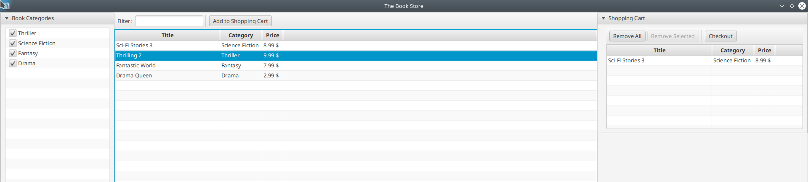

# Module "actionfx-app-sample"

This module contains application sample with and without Spring as bean container.

Module | Description | API Documentation  
------ | ----------- | ----------------- 
[actionfx-app-sample](README.md) | This module contains small sample applications how to use ActionFX with the default bean container using just the actionfx-core module and how to use it with a Spring bean container. | [Javadoc](https://martinkoster.github.io/actionfx/1.6.1/actionfx-app-sample/index.html) 

This module contains the following demo applications:

- [A Simple Book Store](#a-simple-book-store): A FXML-based demo showing most of the annotations available in ActionFX.
  The application has a main class for getting started via ActionFX's core bean container and a main class for getting
  starting with Spring Boot.
- [Datacontainer Demo](#data-container-demo): A statically-coded view demo showing data container configurations
  for `TableView`, `TreeTableView`, `TreeView`, `ListView`, `ChoiceBox` and `ComboBox`.
- [Texteditor Demo](#texteditor-demo): A simple text editor demonstrating how to use menus, open-, save- and other
  dialogs with ActionFX.
- [Validation Demo](#validation-demo): A simple form holding control-based validations.

If you are interested in how ActionFX supports form-binding, you can directly jump into the [CheckoutController](#checkoutcontroller) implementation of the Book Store sample application.

## A Simple Book Store

The sample application features a simple book store, where you can browse a book catalogue (including filtering) and add books to a shopping cart. The demo ends with a modal check-out dialogue.

The application itself can be run inside ActionFX default bean container without Spring or alternatively inside a Spring container. 

For this simple application, we can use exactly the same application code. However, it is differently started from
within different main application classes (refer to source code samples below). Using the same application code with and
without Spring is possible in this case, because we only use Spring's dependency injection mechanism using the
annotation `jakarta.inject.Inject` inside controller classes, which is understood by both ActionFX' default bean
container and Spring.

As a further demo case, the sample application leverages ControlsFX' `org.controlsfx.control.CheckListView` for selecting book categories to display.



### Starting the application with ActionFX' default bean container

For using ActionFX' default bean container, we derive our JavaFX class from [AbstractAFXApplication](../actionfx-core/src/main/java/com/github/actionfx/core/app/AbstractAFXApplication.java).

With the annotation [@AFXApplication](../actionfx-core/src/main/java/com/github/actionfx/core/annotation/AFXApplication.java), we define the root package name for scanning for controllers and the main view to display after application startup.

```java
public class BookstoreAppWithDefaultBeanContainer {

	public static void main(final String[] argv) {
		Application.launch(SampleActionFXApplication.class);
	}

	@AFXApplication(mainViewId = "mainView", scanPackage = "com.github.actionfx.bookstore.controller", enableBeanContainerAutodetection = false)
	public static class SampleActionFXApplication extends AbstractAFXApplication {

	}
}
```
Source Code can be found here: [BookstoreAppWithDefaultBeanContainer](src/main/java/com/github/actionfx/bookstore/core/app/BookstoreAppWithDefaultBeanContainer.java)


### Starting the application with the Spring bean container

In case we want to run our book application in a Spring container, we need to setup our `ActionFX` application instance in the `main` method. We use the configuration class `SampleActionFXApplication` which holds again the `@AFXApplication`  annotation defining the package to scan for ActionFX controller and the main view.
 
```java
@SpringBootApplication
public class BookstoreAppWithSpringBeanContainer {

	public static void main(final String[] argv) {
		ActionFX.builder().configurationClass(SampleActionFXApplication.class).build();
		Application.launch(SampleActionFXApplication.class);
	}

	@AFXApplication(mainViewId = "mainView", scanPackage = "com.github.actionfx.bookstore.controller", enableBeanContainerAutodetection = true)
	public static class SampleActionFXApplication extends Application {

		@Override
		public void init() throws Exception {
			SpringApplication.run(MainAppWithSpringBeanContainer.class);
		}

		@Override
		public void start(final Stage primaryStage) throws Exception {
			ActionFX.getInstance().displayMainView(primaryStage);
		}
	}
}
```

The class `SampleActionFXApplication` is derived from JavaFX `javafx.application.Application` which provides the `init` and `start` methods to override for our demo application.
 
In the `init` method, we start the Spring container. Please remember that `init` is not called from inside the JavaFX-thread. ActionFX however is interacting the JavaFX-thread to initialize its controllers in the JavaFX thread (there are view components like `javafx.scene.web.WebView` that can only be instantiated inside the JavaFX thread).

In the `start` method, we use the supplied `primaryStage` to display the main view inside by calling `ActionFX.getInstance().displayMainView(primaryStage)`.

Source Code can be found here: [BookstoreAppWithSpringBeanContainer](src/main/java/com/github/actionfx/bookstore/spring/app/BookstoreAppWithSpringBeanContainer.java)

### The Controller and Views

The following sections describe all controller and view for the demo book application.

#### MainController

The main controller glues together the different views that are relevant for the book store application: the book catalogue and the shopping cart.

By using the `@AFXNestedView` annotation, we attach the views into the annotated field of type `javafx.scene.layout.BorderPane`.

```java
@AFXController(viewId = "mainView", fxml = "/fxml/MainView.fxml", maximized = true, icon = "/images/book.png", title = "The Book Store")
public class MainController {

	@AFXNestedView(refViewId = "bookCatalogueView", attachToBorderPanePosition = BorderPanePosition.CENTER)
	@AFXNestedView(refViewId = "shoppingCartView", attachToBorderPanePosition = BorderPanePosition.RIGHT)
	@FXML
	private BorderPane contentPane;

}
```

Source Code can be found here: [MainController](src/main/java/com/github/actionfx/bookstore/controller/MainController.java)

#### BookCatalogueController

The book catalogue controller allows to browse books, filtered by a book category and by an additional title filter text.

```java
@AFXController(viewId = "bookCatalogueView", fxml = "/fxml/BookCatalogueView.fxml")
public class BookCatalogueController {

	@FXML
	private CheckListView<String> categoriesCheckListView;

	// enable button, when user selects a book
	@AFXEnableNode(whenAllContolsHaveUserValues = "bookTableView")
	@FXML
	private Button addToShoppingCartButton;
	
	@AFXUseFilteredList(filterPredicateProperty = "catalogueFilterPredicateProperty")
	@AFXEnableMultiSelection
	@AFXCellValueConfig(colId = "titleColumn", propertyValue = "title")
	@AFXCellValueConfig(colId = "categoryColumn", propertyValue = "category")
	@AFXCellValueConfig(colId = "priceColumn", propertyValue = "price", stringConverter = DoubleCurrencyStringConverter.class)
	@FXML
	private TableView<Book> bookTableView;

	// both, ActionFX' BeanContainer and Spring bean container know how to interpret
	// this annotation
	@Inject
	private ShoppingCartController shoppingCartController;

	// holds the predicate that filters our book table
	private final ObjectProperty<Predicate<Book>> catalogueFilterPredicateProperty = new SimpleObjectProperty<>(b -> true);

	@PostConstruct
	public void initialize() {
		categoriesCheckListView.getCheckModel().checkAll();
	}

	@AFXLoadControlData(controlId = "categoriesCheckListView")
	public List<String> loadCategories() {
		return Arrays.asList("Thriller", "Science Fiction", "Fantasy", "Drama");
	}

	@AFXLoadControlData(controlId = "bookTableView", async = true)
	public List<Book> loadBooks() {
		final List<Book> books = new ArrayList<>();
		books.add(new Book("Sci-Fi Stories 3", "Science Fiction", 8.99));
		books.add(new Book("Thrilling 2", "Thriller", 9.99));
		books.add(new Book("Fantastic World", "Fantasy", 7.99));
		books.add(new Book("Drama Queen", "Drama", 2.99));
		return books;
	}

	/**
	 * Immediately fired after the user changes the selection in the
	 * "categoryCheckListView".
	 *
	 * @param selectedCategories the selected categories
	 * @param filterText         the entered filter text (from the control
	 *                           "filterTextField")
	 */
	@AFXOnControlValueChange(controlId = "categoriesCheckListView")
	public void onCategoryChange(final List<String> selectedCategories,
			@AFXControlValue("filterTextField") final String filterText) {
		applyPredicate(filterText, selectedCategories);
	}

	/**
	 * Triggered 400ms after the user typed something in the filter text field.
	 *
	 * @param filterText         the entered filter text
	 * @param selectedCategories the selected categories (from control
	 *                           "categoriesCheckListView")
	 */
	@AFXOnControlValueChange(controlId = "filterTextField", timeoutMs = 400)
	public void onFilterChange(final String filterText,
			@AFXControlValue("categoriesCheckListView") final List<String> selectedCategories) {
		applyPredicate(filterText, selectedCategories);
	}

	/**
	 * Fired when the user clicks on button "Add to Shopping Cart". The selected
	 * books are retrieved from control "bookTableView".
	 *
	 * @param selectedBooks the selected books from control "bookTableView"
	 */
	@AFXOnAction(nodeId = "addToShoppingCartButton")
	public void addToShoppingCart(@AFXControlValue("bookTableView") final List<Book> selectedBooks) {
		shoppingCartController.addToShoppingCart(selectedBooks);
	}

	/**
	 * Constructs and applies a predicate for filtering books.
	 *
	 * @param filterText         the filter text to be applied on the title
	 * @param selectedCategories the categories
	 * @return
	 */
	public void applyPredicate(final String filterText, final List<String> selectedCategories) {
		final Predicate<Book> p = b -> selectedCategories.contains(b.getCategory());
		catalogueFilterPredicateProperty.set(p.and(b -> b.getTitle().toLowerCase().contains(filterText.toLowerCase())));
	}
}
```

The catalogue view holds a ControlsFX `CheckListView` which displays the categories. This control is filled with data from the corresponding method annotated by `@AFXLoadControlData(controlId = "categoriesCheckListView")`:

```java
	@AFXLoadControlData(controlId = "categoriesCheckListView")
	public List<String> loadCategories() {
		...
	}
```

The actual books are displayed in a `javafx.scene.layout.TableView` which is configured to support a multi-selection and a filtering. Additionally, it is configured, which data is displayed in which column via the `AFXCellValueConfig` annotation:

```java
	@AFXUseFilteredList(filterPredicateProperty = "catalogueFilterPredicateProperty")
	@AFXEnableMultiSelection
	@AFXCellValueConfig(colId = "titleColumn", propertyValue = "title")
	@AFXCellValueConfig(colId = "categoryColumn", propertyValue = "category")
	@AFXCellValueConfig(colId = "priceColumn", propertyValue = "price", stringConverter = DoubleCurrencyStringConverter.class)
	@FXML
	private TableView<Book> bookTableView;
```
In plain JavaFX, it would be required to inject the `TableColumn` instances via `@FXML`. In ActionFX, this is not required as the table column instances are looked up in the scene graph using the `colId` attribute in `@AFXCellValueConfig`.

The table view itself is loaded in an asynchronous fashion via:

```java
	@AFXLoadControlData(controlId = "bookTableView", async = true)
	public List<Book> loadBooks() {
		...
	}
```

In a real application, loading can be performed from e.g. a data base. By using asynchronous, non-blocking loading of books, the UI of our application will not freeze.

Now for the actions that are possible inside the UI:

First, we can filter books by selecting/deselecting a book category in the ControlsFX `CheckListView`. Therefore, we define the following callback method, where we also additionally consider a potential filtering text on the book title by using annotation `@AFXControlValue` referring to the text field holding the filter text (category filter and title filter are applied both in a logical "AND" fashion):

```java
	@AFXOnControlValueChange(controlId = "categoriesCheckListView")
	public void onCategoryChange(final List<String> selectedCategories,
			@AFXControlValue("filterTextField") final String filterText) {
		...
	}
```

Second, we can filter books by the aforementioned title filter. Therefore, we define the following callback method, where we also consider the potential category filter, referred to by annotation `@AFXControlValue`:

```java
	@AFXOnControlValueChange(controlId = "filterTextField", timeoutMs = 400)
	public void onFilterChange(final String filterText,
			@AFXControlValue("categoriesCheckListView") final List<String> selectedCategories) {
		...
	}
```

The `@AFXOnControlValueChange` uses attribute `timeoutMs = 400`. This means that the change event is only triggered after 400ms without user interaction typing in the filter text field. This is desired as you might not want to execute the annotated method on every key stroke made by the user.

Last but not least, we define an action method that is invoked when the user wants to add one or multiple books to the shopping cart:

```java
	@AFXOnAction(nodeId = "addToShoppingCartButton")
	public void addToShoppingCart(@AFXControlValue("bookTableView") final List<Book> selectedBooks) {
		shoppingCartController.addToShoppingCart(selectedBooks);
	}
```

In this action method, we inject the **currently selected** books from the table view "bookTableView" via annotation `@AFXControlValue("bookTableView")`.

In this step, we simply hand-over all selected books to the shopping cart controller, described in the next section.

Source Code can be found here: [BookCatalogueController](src/main/java/com/github/actionfx/bookstore/controller/BookCatalogueController.java)

#### ShoppingCartController

The shopping cart controller holds functionality for emptying the shopping cart and for performing the check-out process.

```java
@AFXController(viewId = "shoppingCartView", fxml = "/fxml/ShoppingCartView.fxml")
public class ShoppingCartController {

	// activate button, when the table has items
	@AFXEnableNode(whenAllControlsHaveValues = "bookTableView")
	@FXML
	private Button removeAllButton;

	// activate button, when user selected values
	@AFXEnableNode(whenAllContolsHaveUserValues = "bookTableView")
	@FXML
	private Button removeSelectedButton;

	@AFXEnableNode(whenAllControlsHaveValues = "bookTableView")
	@FXML
	private Button checkoutButton;

	@AFXEnableMultiSelection
	@AFXCellValueConfig(colId = "titleColumn", propertyValue = "title")
	@AFXCellValueConfig(colId = "categoryColumn", propertyValue = "category")
	@AFXCellValueConfig(colId = "priceColumn", propertyValue = "price", stringConverter = DoubleCurrencyStringConverter.class)
	@FXML
	private TableView<Book> bookTableView;

	@AFXOnAction(nodeId = "removeAllButton")
	@AFXRequiresUserConfirmation(title = "Confirmation", header = "Empty Shopping Cart", content = "Are you sure you want to empty the shopping cart?")
	public void emptyShoppingCart() {
		bookTableView.getItems().clear();
	}

	@AFXOnAction(nodeId = "removeSelectedButton")
	@AFXRequiresUserConfirmation(title = "Confirmation", header = "Remove selected books", content = "Are you sure to remove the selected books from the shopping cart?")
	public void removeSelectedBooks(@AFXControlValue("bookTableView") final List<Book> selectedBooks) {
		bookTableView.getItems().removeAll(selectedBooks);
	}

	@AFXOnAction(nodeId = "checkoutButton")
	public void checkout() {
		final OrderSummary model = new OrderSummary();
		model.getOrder().getOrderedBooks().addAll(bookTableView.getItems());

		// publish order summary to start the checkout process
		actionFX.publishEvent(model);
	}

	public void addToShoppingCart(final List<Book> books) {
		bookTableView.getItems().addAll(books);
	}
}

```

The buttons used in our shopping card are using the `@AFXEnableNode` annotation, so that the buttons are only active, when the respective operation shall be made available to the user.

```java
	// activate button, when the table has items
	@AFXEnableNode(whenAllControlsHaveValues = "bookTableView")
	@FXML
	private Button removeAllButton;
```
The "Remove All" button is only activate, if our shopping cards holds any item (no matter, whether these are selected or not. In that case, we must specify the `bookTableView` control as part of attribute `whenAllControlsHaveValues`.

```java
	// activate button, when user selected values
	@AFXEnableNode(whenAllContolsHaveUserValues = "bookTableView")
	@FXML
	private Button removeSelectedButton;
```
The "Remove Selected" button on the other hand shall be only active, when the user selected one or multiple books in our shopping card. For that, the `bookTableView` control is specified in attribute `whenAllContolsHaveUserValues`.

To illustrate the behavior of the buttons that we have configured with `@AFXEnableNode`, we have a look at the following three states of our shopping cart:

**State 1:** The shopping cart is initially empty. Offering options to remove items from it or perform a check-out do not make sense, so these buttons are disabled.


**State 2:** After we added one book to our shopping cart, we offer the user the actions for removing all books from the shopping cart and for performing the check-out. Removing selected books from the shopping cart however still does not make sense as long there is no user selection in our shopping cart.


**State 3:** After we selected one book in our shopping cart, we can also activate the button for removing selected books from our shopping cart.


The action for emptying the shopping cart is quite simple and straight-forward by using the `@AFXOnAction` annotation:

```java
	@AFXOnAction(nodeId = "removeAllButton")
	@AFXRequiresUserConfirmation(title = "Confirmation", header = "Empty Shopping Cart", content = "Are you sure you want to empty the shopping cart?")
	public void emptyShoppingCart() {
		bookTableView.getItems().clear();
	}
```

As you can see here, this method is also annotated with `@AFXRequiresUserConfirmation`. That means that this method is only executed, after the user confirms a confirmation dialog with the given title, header and content text. In case the user cancels this confirmation dialog, the method is not executed and by that, the shopping cart is not emptied.

For starting the check-out procedure, we display the check-out dialogue in a new, modal window having its own `javafx.stage.Stage`. For that, we use ActionFX' internal eventing to publish the oder summary model to the `CheckoutController` via the `actionFX.publishEvent(..)` method. 

```java
	@AFXOnAction(nodeId = "checkoutButton")
	public void checkout() {
		final OrderSummary model = new OrderSummary();
		model.getOrder().getOrderedBooks().addAll(bookTableView.getItems());

		// publish order summary to start the checkout process
		actionFX.publishEvent(model);
	}
```

As a reference, here is the receiving method in the `CheckoutController`:

```java 
	@AFXSubscribe(value = OrderSummary.class)
	@AFXShowView(viewId = "checkoutView", showInNewWindow = true)
	public void onCheckoutStart(final OrderSummary model) {
		...
	}
```

Of course, the `CheckoutController` can be also injected into the `ShoppingCartController` via `@Inject` and the method `onCheckoutStart` for starting the checkout can be directly invoked. However, it might be desirable in some cases that there is a more loose coupling between the controllers, not aware of each other. Additionally, in some cases, the caller is simply not interested in which controller receives the event.

Source Code can be found here: [ShoppingCartController](src/main/java/com/github/actionfx/bookstore/controller/ShoppingCartController.java)

#### CheckoutController 

The check-out controller implements the last step in our book store demo and demonstrates ActionFX' ability to perform a form-binding with an arbitrary Java class.

The form looks as follows:


The checkout dialog is implemented as a modal dialog that lays on top of our book store, thus the applied `@AFXController` annotation uses `modal=true`):

```java
@AFXController(viewId = "checkoutView", fxml = "/fxml/CheckoutView.fxml", icon = "/images/book.png", title = "Check Out", modal = true, width = 600, height = 500, posX = 600, posY = 300)
public class CheckoutController {

	@AFXFormBinding
	@AFXFormMapping(propertyName = "customer.firstName", controlId = "firstNameTextField")
	@AFXFormMapping(propertyName = "customer.lastName", controlId = "lastNameTextField")
	@AFXFormMapping(propertyName = "customer.country", controlId = "countryChoiceBox")
	@AFXFormMapping(propertyName = "customer.street", controlId = "streetTextField")
	@AFXFormMapping(propertyName = "customer.postalCode", controlId = "postalCodeTextField")
	@AFXFormMapping(propertyName = "customer.city", controlId = "cityTextField")
	@AFXFormMapping(propertyName = "order.orderedBooks", controlId = "bookTableView", targetProperty = ControlProperties.ITEMS_OBSERVABLE_LIST)
	@AFXFormMapping(propertyName = "order.orderedBooks", controlId = "bookTableView")
	private final ObjectProperty<OrderSummary> orderSummary = new SimpleObjectProperty<>(new OrderSummary());

	@AFXEnableMultiSelection
	@AFXCellValueConfig(colId = "titleColumn", propertyValue = "title")
	@AFXCellValueConfig(colId = "categoryColumn", propertyValue = "category")
	@AFXCellValueConfig(colId = "priceColumn", propertyValue = "price", stringConverter = DoubleCurrencyStringConverter.class)
	@FXML
	private TableView<Book> bookTableView;

	@AFXEnableNode(whenAllContolsHaveUserValues = { "firstNameTextField", "lastNameTextField", "countryChoiceBox",
			"streetTextField", "postalCodeTextField", "cityTextField" })
	@FXML
	private Button completeOrderButton;

	@Inject
	private ActionFX actionFX;

	@AFXLoadControlData(controlId = "countryChoiceBox")
	public List<String> availableCountries() {
		return Arrays.asList("Germany", "France", "Spain", "Italy", "Portugal", "UK", "USA");
	}

	@AFXSubscribe(value = OrderSummary.class)
	@AFXShowView(viewId = "checkoutView", showInNewWindow = true)
	public void onCheckoutStart(final OrderSummary model) {
		// use the order summary as model for our form-binding
		orderSummary.set(model);
	}

	@AFXOnAction(nodeId = "completeOrderButton")
	public void completeCheckout() {
		actionFX.showInformationDialog("Order successfully placed", createOrderSummary(), "");
		actionFX.hideView(this);
	}

	private String createOrderSummary() {
		final StringBuilder builder = new StringBuilder();
		final OrderSummary model = orderSummary.get();
		builder.append("Shipped to:\n");
		final Customer customer = model.getCustomer();
		final Order order = model.getOrder();
		final DoubleCurrencyStringConverter converter = new DoubleCurrencyStringConverter();
		builder.append(customer.getFirstName() + " " + customer.getLastName() + "\n");
		builder.append(customer.getCountry() + "\n");
		builder.append(customer.getStreet() + "\n");
		builder.append(customer.getPostalCode() + " " + customer.getCity() + "\n");
		builder.append("\n");
		builder.append("Books ordered: " + order.getOrderedBooks().size() + ", Total price: "
				+ converter.toString(order.getOrderedBooks().stream().mapToDouble(Book::getPrice).sum()));
		return builder.toString();
	}

	@AFXOnAction(nodeId = "cancelOrderButton")
	public void cancelCheckout() {
		orderSummary.set(new OrderSummary());
		actionFX.hideView(this);
	}
}
```

As you can see in the class, the model object is supposed to be stored in a `javafx.beans.property.ObjectProperty`:

```java
	@AFXFormBinding
	@AFXFormMapping(propertyName = "customer.firstName", controlId = "firstNameTextField")
	@AFXFormMapping(propertyName = "customer.lastName", controlId = "lastNameTextField")
	@AFXFormMapping(propertyName = "customer.country", controlId = "countryChoiceBox")
	@AFXFormMapping(propertyName = "customer.street", controlId = "streetTextField")
	@AFXFormMapping(propertyName = "customer.postalCode", controlId = "postalCodeTextField")
	@AFXFormMapping(propertyName = "customer.city", controlId = "cityTextField")
	@AFXFormMapping(propertyName = "order.orderedBooks", controlId = "bookTableView", targetProperty = ControlProperties.ITEMS_OBSERVABLE_LIST)
	@AFXFormMapping(propertyName = "order.orderedBooks", controlId = "bookTableView")
	private final ObjectProperty<OrderSummary> orderSummary = new SimpleObjectProperty<>(new OrderSummary());
```

All attributes mapped by `@AFXFormMapping` inside the instance of [OrderSummary](src/main/java/com/github/actionfx/bookstore/model/OrderSummary.java) are bound to the listed controls. 

If you have a closer look at [OrderSummary](src/main/java/com/github/actionfx/bookstore/model/OrderSummary.java) and the embedded classes [Customer](src/main/java/com/github/actionfx/bookstore/model/Customer.java) and [Order](src/main/java/com/github/actionfx/bookstore/model/Order.java), you can see that these classes use Java types like `java.lang.String` and not their JavaFX property counterpart `javafx.beans.property.StringProperty`. However, using `StringProperty` is also possible in this place and would allow even a bidirectional binding between the model attribute and the control's user value property. In our show case, a unidirectional binding with the plain Java types is perfectly sufficient.

It is up to the application designer, whether she/he wants to use plain Java types for unidirectional binding or JavaFX properties for bidirectional binding in their model classes.

In the mapping declaration above, we can also see that it is possible to use different target properties of a control:

```java
	@AFXFormMapping(propertyName = "order.orderedBooks", controlId = "bookTableView", targetProperty = ControlProperties.ITEMS_OBSERVABLE_LIST)
	@AFXFormMapping(propertyName = "order.orderedBooks", controlId = "bookTableView")
```

What happens here is that the list of ordered books is bound to the `itemsProperty` of the used `javafx.scene.control.TableView` via `targetProperty = ControlProperties.ITEMS_OBSERVABLE_LIST` and in the second step, the list of ordered books is then bound to the **selected items list** of the table view. Means: First we fill the table view with the books from the model, and then we select all books inside the table view.

The form binding with the actual data itself occurs in method `onCheckoutStart` that is invoked, when an `OrderSummary` instance is published via `ActionFX.publishEvent(..)` (see implementation of the `ShoppingCartController` for further details).

```java
	@AFXSubscribe(value = OrderSummary.class)
	@AFXShowView(viewId = "checkoutView", showInNewWindow = true)
	public void onCheckoutStart(final OrderSummary model) {
		// use the order summary as model for our form-binding
		orderSummary.set(model);
	}
```

As another feature, we are using the `@AFXEnableNode` annotation to activate the "Complete Order" button only, when the user has provided a value in all controls of the form.

```java
	@AFXEnableNode(whenAllContolsHaveUserValues = { "firstNameTextField", "lastNameTextField", "countryChoiceBox",
			"streetTextField", "postalCodeTextField", "cityTextField" })
	@FXML
	private Button completeOrderButton;
```

Once the book store user confirms his order via the "Complete Order" button, we display a simple order summary with the values from the bound model instance to prove that the model successfully received the values from the controls:


```java
	@AFXOnAction(nodeId = "completeOrderButton")
	public void completeCheckout() {
		actionFX.showInformationDialog("Order successfully placed", createOrderSummary(), "");
		actionFX.hideView(this);
	}
```
After confirming the modal information dialog holding the order summary, we also close the modal checkout dialog via `actionFX.hideView(this)`.

This completes our Book store sample application. 

Source Code can be found here: [CheckoutController](src/main/java/com/github/actionfx/bookstore/controller/CheckoutController.java)

## Data Container Demo

This sample application focuses on the configuration of data container controls like `TableView`, `TreeTableView`, `TreeView`, `ListView`, `ChoiceBox` and `ComboBox`. For this, the controller annotations [@AFXCellValueConfig](../actionfx-core/src/main/java/com/github/actionfx/core/annotation/AFXCellValueConfig.java) and [@AFXConverter](../actionfx-core/src/main/java/com/github/actionfx/core/annotation/AFXConverter.java) are used. Additionally, the demo shows how to implement a view directly instead of using FXML (however, FXML should be mostly preferred).


### Starting the application with ActionFX' default bean container

For starting the appplication, we have mostly the same startup class than for the bookstore app, but now pointing at a different package holding the ActionFX controller and views:

```java
public class DatacontainerApp {

	public static void main(final String[] argv) {
		Application.launch(SampleActionFXApplication.class);
	}

	@AFXApplication(mainViewId = "datacontainerDemoView", scanPackage = "com.github.actionfx.datacontainer.controller")
	public static class SampleActionFXApplication extends AbstractAFXApplication {

	}

}
```

Source Code can be found here: [DatacontainerApp](src/main/java/com/github/actionfx/datacontainer/app/DatacontainerApp.java)

### Coding the Static View 

As mentioned before, in this demo we are not going to use FXML, but we are going to statically code the view (again, FXML should be the preferred way).

```java
public class DatacontainerView extends HBox {

	public DatacontainerView() {
		getChildren().add(createTableView());
		getChildren().add(createListView());
		getChildren().add(createTreeTableView());
		getChildren().add(createTreeView());
		getChildren().add(createComboBox());
		getChildren().add(createChoiceBox());
	}

	@SuppressWarnings("unchecked")
	private TableView<Employee> createTableView() {
		final TableView<Employee> tableView = new TableView<>();
		tableView.setId("employeeTableView");
		final TableColumn<Employee, String> firstNameColumn = new TableColumn<>();
		firstNameColumn.setId("firstNameColumn");
		firstNameColumn.setText("First name");
		firstNameColumn.setPrefWidth(200.0);
		final TableColumn<Employee, String> lastNameColumn = new TableColumn<>();
		lastNameColumn.setText("Last name");
		lastNameColumn.setId("lastNameColumn");
		lastNameColumn.setPrefWidth(200.0);
		final TableColumn<Employee, String> salaryColumn = new TableColumn<>();
		salaryColumn.setId("salaryColumn");
		salaryColumn.setText("Salary");
		salaryColumn.setPrefWidth(100.0);
		tableView.getColumns().addAll(firstNameColumn, lastNameColumn, salaryColumn);
		return tableView;
	}

	private ListView<Employee> createListView() {
		final ListView<Employee> listView = new ListView<>();
		listView.setId("employeeListView");
		listView.setPrefWidth(200.0);
		return listView;
	}

	@SuppressWarnings("unchecked")
	private TreeTableView<Employee> createTreeTableView() {
		final TreeTableView<Employee> tableView = new TreeTableView<>();
		tableView.setId("employeeTreeTableView");
		final TreeTableColumn<Employee, String> firstNameColumn = new TreeTableColumn<>();
		firstNameColumn.setId("firstNameTreeColumn");
		firstNameColumn.setText("First name");
		firstNameColumn.setPrefWidth(200.0);
		final TreeTableColumn<Employee, String> lastNameColumn = new TreeTableColumn<>();
		lastNameColumn.setText("Last name");
		lastNameColumn.setId("lastNameTreeColumn");
		lastNameColumn.setPrefWidth(200.0);
		final TreeTableColumn<Employee, String> salaryColumn = new TreeTableColumn<>();
		salaryColumn.setId("salaryTreeColumn");
		salaryColumn.setText("Salary");
		salaryColumn.setPrefWidth(100.0);
		tableView.getColumns().addAll(firstNameColumn, lastNameColumn, salaryColumn);
		return tableView;
	}

	private TreeView<Employee> createTreeView() {
		final TreeView<Employee> treeView = new TreeView<>();
		treeView.setId("employeeTreeView");
		treeView.setPrefWidth(400.0);
		return treeView;
	}

	private ComboBox<Employee> createComboBox() {
		final ComboBox<Employee> comboBox = new ComboBox<>();
		comboBox.setEditable(true);
		comboBox.setId("employeeComboBox");
		comboBox.setPrefWidth(150);
		return comboBox;
	}

	private ChoiceBox<Employee> createChoiceBox() {
		final ChoiceBox<Employee> choiceBox = new ChoiceBox<>();
		choiceBox.setId("employeeChoiceBox");
		choiceBox.setPrefWidth(150);
		return choiceBox;
	}
}
```

The view class itself needs to be derived from a node that extends from `javafx.scene.Parent`. As you can see, we give relevant nodes an ID, which is required to have them referenced via the `@FXML` annotation in the controller shown in the next section.

Source Code can be found here: [DatacontainerView](src/main/java/com/github/actionfx/datacontainer/view/DatacontainerView.java)

### Coding the Controller and Configuring the Data Controls

Implementing the controller starts again with using the `@AFXControler` annotation. However instead of using the `fxml()` attribute to point at a FXML file, we use the `viewClass()` attribute and point to our statically coded view class in the section before.

All relevant controls that are configured through ActionFX are injected via the `@FXML` annotation. Although we did not use FXML markup to define the view, this works because we gave each relevant control an `id` in the view class.

```java
@AFXController(viewId = "datacontainerDemoView", viewClass = DatacontainerView.class, maximized = true)
public class DatacontainerController {

	@AFXCellValueConfig(colId = "firstNameColumn", propertyValue = "firstName", editable = true)
	@AFXCellValueConfig(colId = "lastNameColumn", propertyValue = "lastName", editable = true)
	@AFXCellValueConfig(colId = "salaryColumn", propertyValue = "salary", stringConverter = DoubleCurrencyStringConverter.class, editable = true)
	@FXML
	private TableView<Employee> employeeTableView;

	@AFXCellValueConfig(stringConverter = EmployeeStringConverter.class, editable = true)
	@FXML
	private ListView<Employee> employeeListView;

	@AFXCellValueConfig(colId = "firstNameTreeColumn", propertyValue = "firstName", editable = true)
	@AFXCellValueConfig(colId = "lastNameTreeColumn", propertyValue = "lastName", editable = true)
	@AFXCellValueConfig(colId = "salaryTreeColumn", propertyValue = "salary", stringConverter = DoubleCurrencyStringConverter.class, editable = true)
	@FXML
	private TreeTableView<Employee> employeeTreeTableView;

	@AFXCellValueConfig(stringConverter = EmployeeStringConverter.class, editable = true)
	@FXML
	private TreeView<Employee> employeeTreeView;

	@AFXConverter(EmployeeStringConverter.class)
	@FXML
	private ComboBox<Employee> employeeComboBox;

	@AFXConverter(EmployeeStringConverter.class)
	@FXML
	private ChoiceBox<Employee> employeeChoiceBox;

	@AFXLoadControlData(controlId = "employeeTableView")
	public List<Employee> loadEmployeeTableData() {
		return Arrays.asList(new Employee("Big", "Boss", 100000.0), new Employee("John", "Doe", 50000.0),
				new Employee("Jane", "Doe", 60000.0), new Employee("New", "Guy", 30000.0));
	}

	@AFXLoadControlData(controlId = "employeeListView")
	public List<Employee> loadEmployeeListData() {
		return loadEmployeeTableData();
	}

	@AFXLoadControlData(controlId = "employeeTreeTableView")
	public TreeItem<Employee> loadEmployeeTreeTableData() {
		final TreeItem<Employee> boss = new TreeItem<>(new Employee("Big", "Boss", 100000.0));
		final TreeItem<Employee> john = new TreeItem<>(new Employee("John", "Doe", 50000.0));
		final TreeItem<Employee> jane = new TreeItem<>(new Employee("Jane", "Doe", 60000.0));
		final TreeItem<Employee> newGuy = new TreeItem<>(new Employee("New", "Guy", 30000.0));
		boss.getChildren().add(john);
		boss.getChildren().add(jane);
		jane.getChildren().add(newGuy);
		return boss;
	}

	@AFXLoadControlData(controlId = "employeeTreeView")
	public TreeItem<Employee> loadEmployeeTreeViewData() {
		return loadEmployeeTreeTableData();
	}

	@AFXLoadControlData(controlId = "employeeComboBox")
	public List<Employee> loadEmployeeComboData() {
		return loadEmployeeTableData();
	}

	@AFXLoadControlData(controlId = "employeeChoiceBox")
	public List<Employee> loadEmployeeChoiceData() {
		return loadEmployeeTableData();
	}

	public static class EmployeeStringConverter extends StringConverter<Employee> {

		@Override
		public String toString(final Employee object) {
			if (object == null) {
				return "";
			}
			return String.format("%s %s %.2f $", object.getFirstName(), object.getLastName(), object.getSalary());
		}

		/**
		 * This method is invoked when the cell content is edited.
		 */
		@Override
		public Employee fromString(final String string) {
			final String[] tokens = string.split(" ");
			final String firstName = getToken(tokens, 0, "");
			final String lastName = getToken(tokens, 1, "");
			final NumberFormat format = NumberFormat.getInstance(Locale.getDefault());
			Double salary = Double.valueOf(0.0);
			try {
				salary = format.parse(getToken(tokens, 2, "0.0")).doubleValue();
			} catch (final ParseException e) {
			}
			return new Employee(firstName, lastName, salary);
		}

		private String getToken(final String[] tokens, final int token, final String defaultValue) {
			return tokens.length > token ? tokens[token] : defaultValue;
		}
	}
}
```

The controller class above shows, how controls containing data can be configured through ActionFX. Controls like `TableView`, `TreeTableView`, `TreeView` and `ListView` have cell factories and cell value factories under the hood to display data. For these control types, annotation [@AFXCellValueConfig](../actionfx-core/src/main/java/com/github/actionfx/core/annotation/AFXCellValueConfig.java) is used. This annotation is capable of mapping a property value from an underlying domain class to e.g. a `TableColumn` via the attribute `colId()` and `propertyValue()`. 

As further show case, the cells of controls of type `TableView`, `TreeTableView`, `TreeView` and `ListView` are editable and accept user input when clicking on the cells (`@AFXCellValueConfig(..., editable = true)`).

For data container like `ComboBox` or `ChoiceBox`, the annotation [@AFXConverter](../actionfx-core/src/main/java/com/github/actionfx/core/annotation/AFXConverter.java) is used to convert a model instance to a displayable string inside these controls.

Source Code can be found here: [DatacontainerController](src/main/java/com/github/actionfx/datacontainer/controller/DatacontainerController.java)

## Texteditor Demo

In this demo, we show how to use menus, open-, save- and other dialogs with ActionFX. For the view, we again use a simple FXML-based layout. 

The application's main class can be found here: [TextEditorApp](src/main/java/com/github/actionfx/texteditor/app/TextEditorApp.java)

The editor itself has a simple menu structure for opening text files, saving text files, closing the application, finding a text and opening a small "About" dialog. 


In the following, we focus on the only controller that we use for our simple text editor.

```java
@AFXController(viewId = "textEditorDemoView", fxml = "/fxml/TextEditor.fxml", maximized = true, title = "Text Editor")
public class TextEditorController {

	@FXML
	private TextArea editorTextArea;

	@Inject
	private ActionFX actionFX;

	@AFXOnAction(nodeId = "openFileMenuItem", async = true)
	public void openFile(@AFXFromFileOpenDialog(title = "Open Text File", extensionFilter = { "Text Files",
			"*.txt" }) final Path path) throws IOException {
		editorTextArea.clear();
		try (final Scanner scanner = new Scanner(path)) {
			scanner.useDelimiter(System.lineSeparator());
			while (scanner.hasNext()) {
				// since we activated "async=true", we are not inside the JavaFX thread.
				// So changing the state of UI components requires us using
				// Platform.runLater(..)
				final String line = scanner.next();
				Platform.runLater(() -> editorTextArea.appendText(line + System.lineSeparator()));
			}
		}
	}

	@AFXOnAction(nodeId = "saveFileMenuItem", async = true)
	public void saveFile(
			@AFXFromFileSaveDialog(title = "Save Text File", extensionFilter = { "Text Files",
					"*.txt" }) final File file,
			@AFXControlValue("editorTextArea") final String text) throws IOException {
		try (final BufferedWriter writer = new BufferedWriter(new FileWriter(file))) {
			writer.write(text);
		}
		// show an information dialog that saving was successful
		Platform.runLater(() -> actionFX.showInformationDialog("Save successful",
				"File '" + file.getAbsolutePath() + "' has been successfully saved.", null));
	}

	@AFXOnAction(nodeId = "closeMenuItem")
	@AFXRequiresUserConfirmation(title = "Exit", header = "Exit Text Editor", content = "Are you sure you want to exit the Text Editor?")
	public void close() {
		Platform.exit();
	}

	@AFXOnAction(nodeId = "findMenuItem")
	public void find(
			@AFXFromTextInputDialog(title = "Find", header = "Search for text", content = "Please enter a text to search for") final String searchText,
			@AFXControlValue("editorTextArea") final String text) {
		final int beginIndex = text.indexOf(searchText);
		if (beginIndex > -1) {
			final int endIndex = beginIndex + searchText.length();
			editorTextArea.selectRange(beginIndex, endIndex);
		} else {
			actionFX.showInformationDialog("Find", "Text '" + searchText + "' has not been found!", null);
		}
	}
	
	@AFXOnAction(nodeId = "aboutMenuItem")
	public void about() {
		actionFX.showInformationDialog("About", "About Text Editor",
				"This is a simple Text Editor realized with ActionFX.");
	}
}
```

The FXML-based scenegraph has a couple of nodes with IDs. However, we only inject the `javafx.scene.control.TextArea` via `@FXML`, because that is the only control that we are directly interacting with for setting the text content to.

Other nodes like the menu items are not injected, these are just referenced via e.g. `@AFXOnAction(nodeId = "openFileMenuItem" ...)`.

Additionally we inject the `ActionFX` instance, because we want to display information dialogs that show the user that a file has been successfully saved or for the "About" dialog.

The **"open file" action** is configured the following way:

```java
	@AFXOnAction(nodeId = "openFileMenuItem", async = true)
	public void openFile(@AFXFromFileOpenDialog(title = "Open Text File", extensionFilter = { "Text Files",
			"*.txt" }) final Path path) throws IOException {
		...
	}
```

The actual file loading is realized in an asynchronous fashion, so that the JavaFX thread is not blocked while loading the data (`@AFXOnAction( ... async = true)`). 

When this action method is triggered, a "file open" dialog is displayed via the method argument annotation `@AFXFromFileOpenDialog`. In case the user cancels the file open dialog, then the method `openFile` will not be executed at all. This is the default behavior for the `@AFXFromFileOpenDialog` (and related annotations). In case the developer wants to have the method called even when the "file open" dialog is cancelled, then the attribute `@AFXFromFileOpenDialog( ... continueOnCancel=true)` has to be set. In this case however, the method argument would be `null` on canceling the "file open" dialog.

In the method itself, each line of the file is read separately and is added to the text area one by one. Because we are running the method asynchronously outside of the JavaFX thread, we need to call `Platform.runLater( .. )` to interact with UI component:

```java
	// since we activated "async=true", we are not inside the JavaFX thread.
	// So changing the state of UI components requires us using
	// Platform.runLater(..)
	final String line = scanner.next();
	Platform.runLater(() -> editorTextArea.appendText(line + System.lineSeparator()));
```

The **"file save" action** is realized in a similar fashion, again realized with an asynchronous method invocation.

```java
	@AFXOnAction(nodeId = "saveFileMenuItem", async = true)
	public void saveFile(
			@AFXFromFileSaveDialog(title = "Save Text File", extensionFilter = { "Text Files",
					"*.txt" }) final File file,
			@AFXControlValue("editorTextArea") final String text) throws IOException {
		...
	}
```

Instead of a "file open" dialog, we display a "file save" dialog now via `@AFXFromFileSaveDialog`. Additionally, we inject the content of the text area via `@AFXControlValue("editorTextArea")` for saving inside the method.

The **"close" action** is using a `@AFXRequiresUserConfirmation` annotation for displaying a confirmation dialog to the user, whether he really wants to shutdown the application. The actual implementation becomes then pretty trivial:

```java
	@AFXOnAction(nodeId = "closeMenuItem")
	@AFXRequiresUserConfirmation(title = "Exit", header = "Exit Text Editor", content = "Are you sure you want to exit the Text Editor?")
	public void close() {
		Platform.exit();
	}
```

The **"find" action** makes use of the `@AFXFromTextInputDialog` annotation to request a search text to be entered by the user. 


Again, this is a method argument annotation that can avoid the actual method to be executed, in case the user cancels the displayed "text input" dialog. 

```java
	@AFXOnAction(nodeId = "findMenuItem")
	public void find(
			@AFXFromTextInputDialog(title = "Find", header = "Search for text", content = "Please enter a text to search for") final String searchText,
			@AFXControlValue("editorTextArea") final String text) {
		...
	}
```

Last but not least, we display a simple **"About" dialog** to the user via an "information" dialog:

```java
    @AFXOnAction(nodeId = "aboutMenuItem")
public void about(){
        actionFX.showInformationDialog("About","About Text Editor",
        "This is a simple Text Editor realized with ActionFX.");
        }
```

Source Code can be found
here: [TextEditorController](src/main/java/com/github/actionfx/texteditor/controller/TextEditorController.java)

## Validation Demo

In this validation-centered demo, we show how controls can be validated and how validation results can be displayed as
decoration to the controls.

The application's main class can be found
here: [ValidationApp](src/main/java/com/github/actionfx/validation/app/ValidationApp.java)

The demo itself consists out of multiple input controls that carry validation-specific annotations.

The initial view without any validation errors, but decorations for the required fields looks as follows:


This sample demonstrates both, manual validation after clicking a button (through `ActionFX.validate()` method) as well
as validation that is triggered after an `change` event occurs on one of the controls.

In the following, the controller code defining the validations is listed:

```java

@AFXController(viewId = "validationView", fxml = "/fxml/ValidationView.fxml", title = "ValidationView", width = 660, height = 450)
public class ValidationController {

  @AFXValidateBoolean(message = "Please confirm", expected = true)
  @FXML
  protected CheckBox checkbox;

  @AFXValidateRegExp(message = "Please enter a valid mail address", regExp = ValidationHelper.EMAIL_ADDRESS_REG_EXP, validationStartTimeoutMs = 300, required = true)
  @FXML
  protected TextField emailTextField;

  @AFXEnableMultiSelection
  @AFXValidateSize(message = "Please select at 2 elements", min = 2)
  @FXML
  protected ListView<String> entryListView;

  @AFXValidateTemporal(message = "Please enter a date in the future with pattern dd.MM.yyyy", future = true, formatPattern = "dd.MM.yyyy", validationStartTimeoutMs = 300)
  @FXML
  protected TextField futureTextField;

  @AFXValidateCustom(validationMethod = "customValidationMethod", validationStartTimeoutMs = 300)
  @FXML
  protected TextField helloWorldTextField;

  @AFXValidateSize(message = "Please enter a name of length 2 and 20", min = 2, max = 20, validationStartTimeoutMs = 300)
  @FXML
  protected TextField nameTextField;

  @AFXValidateMinMax(message = "Please enter a numerical value between 10 and 100", min = 10, max = 100, formatPattern = "#,###", validationStartTimeoutMs = 300)
  @FXML
  protected TextField numericalValueTextField;

  @AFXValidateTemporal(message = "Please select a date in the past", past = true)
  @FXML
  protected DatePicker pastDatePicker;

  @AFXValidateRequired(message = "This is a mandatory field.", validationStartTimeoutMs = 300)
  @FXML
  protected TextField requiredTextField;

  @FXML
  protected Button validateButtonWithDecorations;

  @FXML
  protected Button validateButtonWithoutDecorations;

  @AFXEnableNode(whenAllControlsValid = true)
  @FXML
  protected Button allControlsValidButton;

  @AFXEnableNode(whenControlsAreValid = {"requiredTextField", "pastDatePicker"})
  @FXML
  protected Button twoControlsValidButton;

  @Inject
  protected ActionFX actionFX;

  @AFXLoadControlData(controlId = "entryListView")
  public List<String> listViewData() {
    return Arrays.asList("Value 1", "Value 2", "Value 3", "Value 4");
  }

  public ValidationResult customValidationMethod(final String text) {
    return ValidationResult.builder().addErrorMessageIf("Please enter 'Hello World' only.", helloWorldTextField,
            !"Hello World".equals(text));
  }

  @AFXOnAction(nodeId = "validateButtonWithDecorations", async = false)
  public void validateButtonWithDecorationsAction(final ActionEvent event) {
    actionFX.validate(this);
  }

  @AFXOnAction(nodeId = "validateButtonWithoutDecorations", async = false)
  public void validateButtonWithoutDecorationsAction(final ActionEvent event) {
    final ValidationResult result = actionFX.validate(this, false);
    final StringBuilder b = new StringBuilder();
    if (result.getStatus() == ValidationStatus.ERROR) {
      b.append("Validation errors have occured:\n");
      for (final ValidationMessage msg : result.getErrors()) {
        b.append(msg.getText()).append("\n");
      }
    } else {
      b.append("Validation successful with status '").append(result.getStatus()).append("'.");
    }
    actionFX.showInformationDialog("Validation", b.toString(), "");
  }

}
```

The code shows the usage of the different validation-specific annotations.

The most notable functionality inside this controller is:

* Custom validation using the supplied method:
  ```java 
  @AFXValidateCustom(validationMethod = "customValidationMethod", validationStartTimeoutMs = 300)
  @FXML
  protected TextField helloWorldTextField;

    public ValidationResult customValidationMethod(final String text) {
    return ValidationResult.builder().addErrorMessageIf("Please enter 'Hello World' only.", helloWorldTextField,
            !"Hello World".equals(text));
  }
    ```
  Here, the entered text is validated in the supplied method and a validation error is displayed, whenever the content
  of the text field is not "Hello World". The value of text field is directly injected into the validation method as
  method argument.
* Enablement of controls like e.g. buttons, when defined controls inside the view are valid:
  ```java
  @AFXEnableNode(whenControlsAreValid = {"requiredTextField", "pastDatePicker"})
  @FXML
  protected Button twoControlsValidButton;
  ```
  In order for the button to be enabled, the values inside the controls "requiredTextField" and "pastDatePicker" need to
  be valid.
  
* Enablement of controls like e.g. buttons, when all controls inside the view are valid:
  ```java
  @AFXEnableNode(whenAllControlsValid = true)
  @FXML
  protected Button allControlsValidButton;
  ```
  In order for the button to be enabled, **all** values inside the controls need to be valid.
  
* Manual validation including the display of all validation decorations can be triggered by a button click as follows:
  ```java
  @AFXOnAction(nodeId = "validateButtonWithDecorations", async = false)
  public void validateButtonWithDecorationsAction(final ActionEvent event) {
    actionFX.validate(this);
  }
  ```
* Manual validation with a programmatic handling of validation errors can be triggered as follows:
  ```java
  @AFXOnAction(nodeId = "validateButtonWithoutDecorations", async = false)
  public void validateButtonWithoutDecorationsAction(final ActionEvent event) {
    final ValidationResult result = actionFX.validate(this, false);
    final StringBuilder b = new StringBuilder();
    if (result.getStatus() == ValidationStatus.ERROR) {
      b.append("Validation errors have occured:\n");
      for (final ValidationMessage msg : result.getErrors()) {
        b.append(msg.getText()).append("\n");
      }
    } else {
      b.append("Validation successful with status '").append(result.getStatus()).append("'.");
    }
    actionFX.showInformationDialog("Validation", b.toString(), "");
  }
  ```
  In this method, the validation result is computed and returned after calling method `actionFX.validate(this, false)`
  and the validation messages are displayed in a popup window.

  

Source Code can be found
here: [ValidationController](src/main/java/com/github/actionfx/validation/controller/ValidationController.java)

