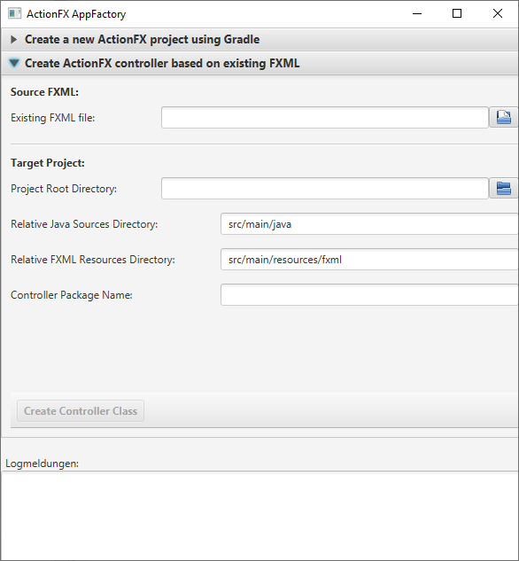

# Module "actionfx-appfactory"

This module contains command-line tools for quickly setting up new ActionFX applications.

Module | Description | API Documentation  
------ | ----------- | ----------------- 
[actionfx-appfactory](README.md) | This module contains an executable ActionFX application to easily scaffold new, Gradle-based ActionFX projects. Aside from generating the required build files, it generates ActionFX controller from existing FXML files for enhanced productivity. | [Javadoc](https://martinkoster.github.io/actionfx/1.5.2/actionfx-appfactory/index.html) 

## Scaffolding with ActionFX AppFactory

ActionFX' AppFactory (start application [ActionFXAppFactory](src/main/java/com/github/actionfx/appfactory/ActionFXAppFactory.java) offers you two possible scaffolding options.  which are detailed in the following sections.

### Create a new Gradle-based ActionFX project

Under the accordion tab "Create a new ActionFX project using Gradle", you can enter the basic parameters, where the project shall be generated to:


For the new project, you can decide if a an empty main view shall be generated (which just consists out of an basic FXML file you can adjust afterwards), or if you want to use an already existing FXML file as main view. In the latter case, the existing FXML file will be copied into the new project, as it must be accessible through the classpath of the application.

The folder layout of the project in e.g. Eclipse will look as follows:


### Create a new ActionFX Controller based on an existing FXML

Under the accordion tab "Create ActionFX Controller based on existing FXML", you can create a controller from an existing FXML file, where all JavaFX nodes containing an ID are already injected into the created controller via `@FXML`. Additionally, controls having an `onAction` property will be referenced from the controller and methods for the actions are also created.
 


A newly generated controller will look as follows:

```java
package com.github.actionfx.appfactory.controller;

import com.github.actionfx.core.annotation.AFXController;
import com.github.actionfx.core.annotation.AFXOnAction;
import javafx.event.ActionEvent;
import javafx.fxml.FXML;
import javafx.scene.control.MenuItem;
import javafx.scene.control.Button;
import javafx.scene.control.TableView;

/**
 * ActionFX controller for FXML view "/MainView.fxml"
 *
 * @author actionfx-appfactory
 *
 */
@AFXController(viewId = "MainView", fxml = "/MainView.fxml", title = "MainView")
public class MainController {

	@FXML
	protected MenuItem closeMenuItem;
	
	@FXML
	protected Button okButton;
	
	@FXML
	protected TableView tableView;
	
    ...

	// Action method was mentioned in FXML 
	public void closeMenuItem(ActionEvent event) {
		// TODO: implement action method
	}
	
	// Action method was generated for a control, because it had an ID
	@AFXOnAction(nodeId = "okButton", async = false)
	public void okButtonAction(ActionEvent event) {
		// TODO: implement action method
	}
```

As you can see above, action methods in an ActionFX controller are generated for the following two cases:
- In the FXML document, the defined control references a method by name, e.g. like: 


- The control inside the FXML document has an ID and is having an `onAction` property, but is left empty in the FXML, e.g. like e.g.


 