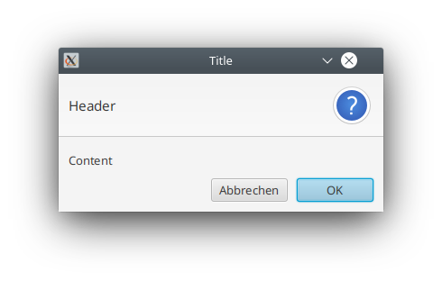

# Module "actionfx-core"

The "actionfx-core" module consists of the core functionality of ActionFX.

Module | Description | API Documentation 
------ | ----------- | ----------------- 
[actionfx-core](README.md) | The core routines around ActionFX. It contains the central class [ActionFX](actionfx-core/src/main/java/com/github/actionfx/core/ActionFX.java) for accessing controllers and views. As ActionFX uses an internal bean container with dependency injection support, it is recommended to wire all controllers with @Inject instead of accessing them through this class (please note that there is also support of Spring's bean container through ActionFX's `actionfx-spring-boot` module). | [Javadoc](https://martinkoster.github.io/actionfx/1.4.0/actionfx-core/index.html) 

**Gradle Dependency**

```
implementation group: "com.github.martinkoster", name: "actionfx-core", version: "1.4.0"
```

**Maven Dependency**

```xml
<dependency>
    <groupId>com.github.martinkoster</groupId>
    <artifactId>actionfx-core</artifactId>
    <version>1.4.0</version>
</dependency>
```

## Table of Contents

- [Module "actionfx-core"](#module-actionfx-core)
  * [Table of Contents](#table-of-contents)
  * [Overview](#overview)
  * [Setting up ActionFX](#setting-up-actionfx)
    + [Derive your JavaFX application from AbstractAFXApplication](#derive-your-javafx-application-from-abstractafxapplication)
    + [Build your own instance of ActionFX during application startup](#build-your-own-instance-of-actionfx-during-application-startup)
  * [Implementing ActionFX controllers](#implementing-actionfx-controllers)
    + [Example of a Controller Definition with Nested Views](#example-of-a-controller-definition-with-nested-views)
    + [Annotations for handling Views](#annotations-for-handling-views)
      - [Annotation @AFXNestedView (Field Annotation for fields annotated with @FXML)](#annotation-afxnestedview)
      - [Annotation @AFXShowView (Method Annotation)](#annotation-afxshowview)
    + [Annotations for working with JavaFX controls and their values](#annotations-for-working-with-javafx-controls-and-their-values)      
      - [Annotation @AFXLoadControlValue (Method Annotation)](#annotation-afxloadcontrolvalue)
      - [Annotation @AFXOnControlValueChange (Method Annotation)](#annotation-afxoncontrolvaluechange)
      - [Annotation @AFXArgHint (Method Argument Annotation)](#annotation-afxarghint)
      - [Annotation @AFXControlValue (Method Argument Annotation)](#annotation-afxcontrolvalue)
      - [Annotation @AFXConverter (Field Annotation)](#annotation-afxconverter)
      - [Annotation @AFXOnAction (Method Annotation)](#annotation-afxonaction)
    + [Annotations for declarative Form-Binding](#annotations-for-declarative-form-binding)  
      - [Annotation @AFXFormBinding (Field Annotation)](#annotation-afxformbinding)
      - [Annotation @AFXFormMapping (Field Annotation)](#annotation-afxformmapping)
    + [Annotations for configuring Tables](#annotations-for-configuring-tables)      
      - [Annotation @AFXCellValueConfig (Field Annotation)](#annotation-afxcellvalueconfig)
      - [Annotation @AFXEnableMultiSelection (Field Annotation for fields annotated with @FXML)](#annotation-afxenablemultiselection)
      - [Annotation @AFXUseFilteredList (Field Annotation for fields annotated with @FXML)](#annotation-afxusefilteredlist)
    + [Annotations for controlling the disabled state of a Node](#annotations-for-controlling-the-disabled-state-of-a-node)      
      - [Annotation @AFXEnableNode (Field Annotation)](#annotation-afxenablenode)
      - [Annotation @AFXDisableNode (Field Annotation)](#annotation-afxdisablenode)
    + [Annotations triggering User Dialogs](#annotations-triggering-user-dialogs)
      - [Annotation @AFXRequiresUserConfirmation (Method Annotation)](#annotation-afxrequiresuserconfirmation)
      - [Annotation @AFXFromFileSaveDialog (Method Argument Annotation)](#annotation-afxfromfilesavedialog)
      - [Annotation @AFXFromFileOpenDialog (Method Argument Annotation)](#annotation-afxfromfileopendialog)
      - [Annotation @AFXFromDirectoryChooserDialog (Method Argument Annotation)](#annotation-afxfromdirectorychooserdialog)
      - [Annotation @AFXFromTextInputDialog (Method Argument Annotation)](#annotation-afxfromtextinputdialog)
  * [User Value of Controls](#user-value-of-controls)
  * [Internationalization](#internationalization)

## Overview

This module provides:
- The central class [ActionFX](src/main/java/com/github/actionfx/core/ActionFX.java) for retrieving views and controllers (however, retrieving controllers and views via dependency injection via fields annotated by @Inject should be preferred). An instance of the ActionFX class can be retrieved after successful setup via `ActionFX.getInstance()`
- A bean container that supports dependency injections via @Inject and supports post construction method invocation via @PostConstruct.
- Controller definitions via the [@AFXController](src/main/java/com/github/actionfx/core/annotation/AFXController.java) annotation, declaring FXML-based views.
- Support for nested views: It is possible to embed further views into a view via the [@AFXNestedView](src/main/java/com/github/actionfx/core/annotation/AFXNestedView.java) annotation, either as part of the controller definition in [@AFXController](src/main/java/com/github/actionfx/core/annotation/AFXController.java) or by applying the [@AFXNestedView](src/main/java/com/github/actionfx/core/annotation/AFXNestedView.java) annotation on @FXML annotated view components.
- Byte-code enhancement via [ActionFXByteBuddyEnhancer](src/main/java/com/github/actionfx/core/instrumentation/bytebuddy/ActionFXByteBuddyEnhancer.java) facilities in order to enhance controller classes and to allow aspect-oriented programming. Two strategies are supported: byte-code enhancement via a Java agent installed at runtime, or enhancement by sub-classing. 
- Annotations are provided that can be used inside ActionFX controllers to wire JavaFX controls to controller methods. No more tons of code like `tableView.getSelectionModel().getSelectedItem().addChangeListener((observable, oldValue, newValue) -> onTableViewSelect(newValue));`. This makes the code more readable and maintainable.
- Methods annotated by [@AFXShowView](src/main/java/com/github/actionfx/core/annotation/AFXShowView.java) can be used to implement a flow between view. Those annotated methods are intercepted and after successful method invocation, the desired view is shown (either as nested view in the current scene graph by attaching the sub-view or by displaying the view in a new stage).


## Setting up ActionFX

There are two ways to setup ActionFX for your JavaFX application:

### Derive your JavaFX application from AbstractAFXApplication

When deriving your JavaFX class from [AbstractAFXApplication](src/main/java/com/github/actionfx/core/app/AbstractAFXApplication.java), all you need to do is to put an additional [@AFXApplication](src/main/java/com/github/actionfx/core/annotation/AFXApplication.java) annotation on your class in order to specify the main view ID and the package to scan for controllers:

```java
public class MainApp {

	public static void main(String[] argv) {
		Application.launch(SampleActionFXApplication.class);
	}

	@AFXApplication(mainViewId = "mainView", scanPackage = "com.github.actionfx.sampleapp.core.app")
	public static class SampleActionFXApplication extends AbstractAFXApplication {

	}

}
```

In the example above, the package `com.github.actionfx.sampleapp.core.app` is scanned for controller annotated with the [@AFXController](src/main/java/com/github/actionfx/core/annotation/AFXController.java) annotation. One of the controller is expected to declare the main view with id `mainView` which is displayed as soon as JavaFX's primary stage is ready.


### Build your own instance of ActionFX during application startup

Instead of using the base class mentioned in the previous section, an own customized ActionFX instance can be setup with:

```java
	@Override
	public void init() throws Exception {
		ActionFX.builder().configurationClass(getClass()).build();
	}
```

The builder for the ActionFX instance offers the following configuration options:

Builder Method | Description
-------------- | -----------
`configurationClass(final Class<?> configurationClass)` | Reads out the `AFXApplication` annotation that is expected to be  present on the given `configurationClass`. In case the annotation is not present on the given class (or on its super-classes), an `IllegalArgumentException` is thrown.
`mainViewId(final String mainViewId)` | Sets the ID / name of the view that is used to be displayed in JavaFX's primary `Stage`. Please note that this ID must of course exist inside ActionFX's container e.g. by annotating a controller with `AFXController` and defining this view ID there.
`scanPackage(final String scanPackage)` | The package name with dot-notation "." that shall be scanned for ActionFX components.
`enhancementStrategy(final EnhancementStrategy enhancementStrategy)` | The byte-code enhancement strategy to use within ActionFX. Currently the following enhancement strategies are available:1.) `EnhancementStrategy.RUNTIME_INSTRUMENTATION_AGENT}`: A byte-code instrumentation agent is installed/attached at runtime. Methods of controllerclasses are directly enhanced via method interceptors. 2.) `EnhancementStrategy.SUBCLASSING`: Controller classes are sub-classed, while controller methods are overriden and method interceptors are attached.
`actionFXEnhancer(final ActionFXEnhancer actionFXEnhancer)` | Sets the implementation of interface `ActionFXEnhancer` to use within ActionFX. In case there is no instance set, the default enhancer `ActionFXByteBuddyEnhancer` is used. Please note that implementations of interface `ActionFXEnhancer` must provide the possibility of both, byte code instrumentation via a runtime agent and byte code enhancement via sub-classing.
`uncaughtExceptionHandler(final UncaughtExceptionHandler uncaughtExceptionHandler)` | Configures an exception handler for uncaught exceptions.
`locale(final Locale locale)` | Configures a `java.util.Locale` for internationalization. The locale itself is wrapped into an `ObservableValue<Locale>`
`observableLocale(final ObservableValue<Locale> observableLocale)` | Configures an `javafx.beans.value.ObservableValue` that holds a proper `java.util.Locale` for internationalization.
`controllerExtension(final Consumer<Object>... extensions)`  | Registers custom controller extensions instances implemented by the user. Controller extensions are applied to the controller after instantiation, after dependency injection, but before methods annotated with `@PostConstruct` are invoked. As mandated by the design philosophy, this builder method accepts a generic `Consumer` instance, where it is up to the developer to decide what to do with the controller instance. In case you are interested in doing something with a field, you can derive your implementation from [AbstractAnnotatedFieldControllerExtension](src/main/java/com/github/actionfx/core/container/extension/AbstractAnnotatedFieldControllerExtension.java). For extending methods, you can derive your implementation from [AbstractAnnotatedMethodControllerExtension](src/main/java/com/github/actionfx/core/container/extension/AbstractAnnotatedMethodControllerExtension.java).
`controllerExtension(final Class<? extends Consumer<Object>>... extensionClasses)` | Same as `controllerExtension(final Consumer<Object>... extensions)`, but the extension classes are instantiated by ActionFX. It is expected that these extension implementations have a default no-argument constructor.

Once the ActionFX instance is setup with all configuration parameters, it is required to scan for components / controllers with

```java
	ActionFX.getInstance().scanForActionFXComponents();
```

Once the ActionFX instance is configured and initialized with components, you can display the main view with:


```java
	@Override
	public void start(Stage primaryStage) throws Exception {
		ActionFX.getInstance().displayMainView(primaryStage);
	}
```

## Implementing ActionFX controllers

By using annotation [@AFXController](src/main/java/com/github/actionfx/core/annotation/AFXController.java) on a class, this class becomes an ActionFX controller. A controller is responsible for holding the actions that can be triggered from a view, preferably defined in an FXML document.

The following attributes are available as part of the [@AFXController](src/main/java/com/github/actionfx/core/annotation/AFXController.java) annotation:

Attribute | Description | Default Value
--------- | ----------- | -------------
`viewId` | The ID of the view. Must be unique among all views of this application. | -
`fxml` | Path to the FXML file to load for this view. Path is relative to the application's classpath. In case you have your view not in an FXML file, but implemented in an individual class, please refer to attribute `viewClass()`. | `""`
`viewClass` | Alternatively to the `fxml()` attribute for defining a view's scene graph, it is also possible to load a view from a specified class. A view class specified under this location must be derived from `javafx.scene.Parent`. | `javafx.scnene.Parent.class`
`modal` | Specifies whether this view is a modal dialog or a regular window. | `false` 
`maximized` | Specifies whether this view shall be displayed maxized or not. | `false`
`width` | The width of the view (however `maximized` has a higher priority) | `200`
`height` | The height of the window (however `maximized` has a higher priority). | `100`
`title` | The title to be displayed for the given view/window. | `""`
`posX` | The X position of the window on the screen. | `0`
`poxY` | The Y position of the window on the screen. | `0`
`icon` | The icon to be displayed in case the view is displayed in its own stage. | `""`
`singleton` | Determines whether the view (and by that the controller) is managed as singleton or not. If the view is not a singleton, the view is newly created whenever it is requested. | `true`
`lazyInit` |  Flag that controls the initialization of the view and controller. If set to `true`, view components are lazily initialized at the point the view is really required and requested from the bean container. If set to `false`, the view components are initialized at the startup of the ActionFX application, when the bean container of ActionFX is initialized. Although lazy loading should be preferred, disabling of lazy loading makes sense, when you want to have a fail-early fail-fast pattern and exceptions during view initializations should/must be thrown at application startup (and not later, when you already work with the application). | `true`
`stylesheets` | Which stylesheets shall be applied to the scene? This array contains a list of classpath locations to CSS files. | `{}`
`resourcesBasename` | Defines the location of `java.util.ResourceBundle` files in case the loaded view for the annotated controller relies on the presence of the resource bundles for internationalization. Important to note for resource properties is that you need to use the dot-notation to specify the location. So for example the properties file reside in classpath location `/i18n/SomeResource_en_UK.properties`, the appropriate `resourcesBasename()` would be `i18n.SomeResource` | `""`

After defining the controller and scanning for ActionFX components (see previous chapters on how to setup ActionFX), an instance of the controller is retrieved by:

```java
	SomeController someController = ActionFX.getInstance().getController(SomeController.class);
```

Preferably, you can just annotate a field with `@Inject` (if the controller is called from another controller):

```java
@AFXController(viewId = "mainView", fxml = "/fxml/MainView.fxml", maximized = true)
public class MainController {
	
	// Controller "SomeController" is injected into the "MainController"
	@Inject
	private SomeController someController;
}
```

Please note that controller **must not be instantiated directly** via the `new` keyword, because ActionFX is enhancing the class in the background and is evaluating the [@AFXController](src/main/java/com/github/actionfx/core/annotation/AFXController.java) annotation.

### Example of a Controller Definition with Nested Views

The following code snippet show how a controller definition can look like, while other controllers and their views are wired into the FXML-bassed view. 

```java
@AFXController(viewId = "mainView", fxml = "/fxml/MainView.fxml", maximized = true)
public class MainController {

	@AFXNestedView(refViewId = "productCatalogListView")
	@FXML
	private ScrollPane productListScrollPane;

	@AFXNestedView(refViewId = "productDetailsView", attachToAnchorBottom = 0.0, attachToAnchorLeft = 0.0, attachToAnchorRight = 0.0, attachToAnchorTop = 0.0)
	@FXML
	private AnchorPane productDetailsAnchorPane;

	@AFXNestedView(refViewId = "shoppingCartView", attachToAnchorBottom = 0.0, attachToAnchorLeft = 0.0, attachToAnchorRight = 0.0, attachToAnchorTop = 0.0)
	@FXML
	private AnchorPane shoppingCartAnchorPane;
	
	@PostConstruct
	public void initialize() {
		// some custom initialization goes here
	}
}
```

Please note that the fields annotated by [@AFXNestedView](src/main/java/com/github/actionfx/core/annotation/AFXNestedView.java) are required to carry the @FXML annotation. It would be also possible to define the nested views as part of the [@AFXController](src/main/java/com/github/actionfx/core/annotation/AFXController.java) annotation. In the latter case, the fields are not required to be injected via @FXML (they don't even need to be present in the class). However, it is required that the FXML view components can be referenced by an unique ID.

The following example shows how to use nested views in the [@AFXController](src/main/java/com/github/actionfx/core/annotation/AFXController.java) annotation:

```java
@AFXNestedView(refViewId = "productCatalogListView", attachToNodeWithId="productListScrollPane")
@AFXNestedView(refViewId = "productDetailsView", attachToNodeWithId="productDetailsAnchorPane", attachToAnchorBottom = 0.0, attachToAnchorLeft = 0.0, attachToAnchorRight = 0.0, attachToAnchorTop = 0.0)
@AFXNestedView(refViewId = "shoppingCartView", attachToNodeWithId="shoppingCartAnchorPane", attachToAnchorBottom = 0.0, attachToAnchorLeft = 0.0, attachToAnchorRight = 0.0, attachToAnchorTop = 0.0)
@AFXController(viewId = "mainView", fxml = "/fxml/MainView.fxml", maximized = true)
public class MainController {

	@PostConstruct
	public void initialize() {
		// some custom initialization goes here
	}
}
```

Please note in the example above, the additional attribute `attachToNodeWithId` needs to be provided, so that ActionFX knows to which node the nested view needs to be attached to.

There are various annotations that you can apply to controller methods and fields that are reducing the amount of code that you need for wiring your controls and methods. In the following sections, an overview on the available annotations is provided.

### Annotations for handling Views

The following annotations are provided by ActionFX to work with views.

#### Annotation @AFXNestedView

The [@AFXNestedView](src/main/java/com/github/actionfx/core/annotation/AFXNestedView.java) annotation defines a nested view to be embedded into a scene graph. Nested views can be used to composite the overall scene graph view.

You can either use this annotation as part of an `AFXController` annotation, or you can apply it to a field that is also annotated by `@FXML`.

The following attributes are available inside the annotation:

Attribute 							| Description 
----------------------------------- | -------------------------------------------------
`refViewId` 						| The referenced view ID that shall nested in the view.
`attachToNodeWithId`				| The parent node ID where the nested view shall be attached to. Please note that this ID is a real node ID in the JavaFX scene graph. This field is mandatory, if this annotation is used inside a `@AFXController` annotation. If used on a field annotated by `@FXML`, this value is irrelevant.
`attachToIndex`					| Optional index referring to the target node's children list, where the view shall be attached to.
`attachToColumn`					| Optional column index in case the target node is a `javafx.scene.layout.GridPane`. Must be used together with `attachInRow`.
`attachToRow`						| Optional row index in case the target node is a `javafx.scene.layout.GridPane`. Must be used together with `attachInColum`.
`attachToBorderPanePosition`		| Optional border pane position in case the target node is a `javafx.scene.layout.BorderPane`.
`attachToAnchorLeft`				| Optional anchor left in case the target node is an `javafx.scene.layout.AnchorPane`. Must be used together with `attachToAnchorTop`, `attachToAnchorRight` and `attachToAnchorBottom`.
`attachToAnchorTop`				| Optional anchor top in case the target node is an `javafx.scene.layout.AnchorPane`. Must be used together with `attachToAnchorLeft`, `attachToAnchorRight` and `attachToAnchorBottom`.
`attachToAnchorRight`				|  Optional anchor right in case the target node is an `javafx.scene.layout.AnchorPane`. Must be used together with `attachToAnchorTop`, `attachToAnchorLeft` and `attachToAnchorBottom`.
`attachToAnchorBottom`			| Optional anchor bottom in case the target node is an `javafx.scene.layout.AnchorPane`. Must be used together with `attachToAnchorTop`, `attachToAnchorRight` and `attachToAnchorLeft`.

**Example:**

```java
	@AFXNestedView(refViewId = "productCatalogListView")
	@FXML
	private ScrollPane productListScrollPane;
	...
	@AFXNestedView(refViewId = "productDetailsView", attachToAnchorBottom = 0.0, attachToAnchorLeft = 0.0, attachToAnchorRight = 0.0, attachToAnchorTop = 0.0)
	@FXML
	private AnchorPane productDetailsAnchorPane;
	...
	@AFXNestedView(refViewId = "productDetailsView", attachToBorderPanePosition = BorderPanePosition.CENTER)
	@FXML
	private BorderPane shopingCartAnchorPane;
	...
	@AFXNestedView(refViewId = "productFeedbackView", attachToColumn = 3, attachInRow = 2)
	@FXML
	private GridPane productFeedbackGridPane;
```

#### Annotation @AFXShowView

The [@AFXShowView](src/main/java/com/github/actionfx/core/annotation/AFXShowView.java) can be applied at method-level to navigate between different views from inside a controller class.

The annotation provides different options how the new view shall be displayed. The following attributes are available in [@AFXShowView](src/main/java/com/github/actionfx/core/annotation/AFXShowView.java):

Attribute 					| Description 
--------------------------- | -------------------------------------------------
`viewId`	 				|  The view to be displayed, when the method successfully terminates. This attribute competes with attribute `showNestedViews()`, while this attribute has higher precedence than `showNestedViews()` 
`showInNewWindow` 		|  Determines whether the view defined in `viewId()` shall be displayed in its own `Stage`. The specification of this attribute does not affect view transition in case the attribute `showNestedViews()` is given.
`showNestedViews` 		| The nested views to be displayed, when the method successfully terminates. This attribute allows to embed view into the current scene graph and `Stage`. Please take note, that this attribute must not be used together with `showView()` and `showInNewWindow()`.

Please note that only *one* attribute starting with `show*` must be used at the same time (they can not be combined).

**Example:**
```java
	@AFXShowView(viewId="detailsView")
	public void actionMethod() {
		// some further initialization goes here - or leave it just empty
	}
```


### Annotations for working with JavaFX controls and their values

Working with controls that receive user values is a central part of JavaFX and, of course, of ActionFX. Setting and accessing these values is a central part of ActionFX. The following annotations are provided by ActionFX.

#### Annotation @AFXLoadControlValue

The [@AFXLoadControlValue](src/main/java/com/github/actionfx/core/annotation/AFXLoadControlValue.java) annotation can  be applied to methods that return a value that is usable as value inside a referenced control (e.g. load all entities to be displayed inside a TableView or load a text to be displayed in a text area)

It is possible perform the loading of data in an asynchronous fashion in a separate thread outside the JavaFX thread by using the attribute `async` (see below). 

The following attributes are available inside the annotation:

Attribute                           | Description 
----------------------------------- | -------------------------------------------------
`controlId`						| ID of the control whose values shall be loaded for by the annotated method
`async`								| Optional flag that determines, whether the data shall be loaded in an asynchronous fashion. When set to `true`, the annotated method is not executed inside the JavaFX-thread, but in its own thread in order not to block the JavaFX thread. The data itself however is set again to the referenced control from inside the JavaFX thread. Default is `false`.
`loadingActiveBooleanProperty`	| An optional expression that must resolve to a field of type `BooleanProperty`, if specified. The annotated method is only called after construction (before `@PostConstruct` initialization methods), the boolean property holds the value `true`. After construction time, the data is loaded, whenever the boolean property switches its value from `false` to `true`.
`order`								| An optional order that can be specified to define the order of execution of the annotated method, in case more than one data loading routine is present inside the ActionFX controller.

**Example:**
```java
	// for the @AFXLoadControlData annotation to work, it is not required that the table view is injected via @FXML
	@FXML
 	private TableView<Product> productsTableView;
 	...
	private BooleanProperty loadProductsBooleanProperty = new SimpleBooleanProperty(true);
	...
	@AFXLoadControlData(controlId = "productsTableView", async = true, loadingActiveBooleanProperty = "loadProductsBooleanProperty")
	public List<Product> loadProductsAsynchronously() {
		// loading logic for products goes here. E.g. load it from the data base
	}
```

#### Annotation @AFXOnControlValueChange

The [@AFXOnControlValueChange](src/main/java/com/github/actionfx/core/annotation/AFXOnControlValueChange.java) annotation is applied to methods, which are then invoked, when the user changes a value in the referenced control identified by the attribute `controlId`.

Annotated methods can be of the following signature:

For controls with a single-value (e.g. for texts in a `TextField` or a single-selection inside a `TableView`):

- `void methodName()`
- `void methodName(TYPE newValue)`
- `void methodName(TYPE newValue, TYPE oldValue, ObservableValue<TYPE> observableValue)`

For controls with multi-values (e.g. for a multi-selection inside a`TableView`):

- `void methodName()`
- `void methodName(ObservableList<TYPE> selectedValue)`
- `void methodName(ObservableList<TYPE> selectedValue, List<TYPE> addedList, List<TYPE> removedList, javafx.collections.ListChangeListener.Change change)`

The above signatures are supported without requiring the use of the [@AFXArgHint](src/main/java/com/github/actionfx/core/annotation/AFXArgHint.java) annotation. In case you need to change the order of the arguments, you will need to specify hints for defining, which argument is e.g. the "new" value (use `@AFXArgHint` with `ArgumentHint#NEW_VALUE`) and which argument is the "old" value
  (use `AFXArgHint` with `ArgumentHint#OLD_VALUE`).

The following attributes are available inside the annotation:

Attribute 							| Description 
----------------------------------- | -------------------------------------------------
`controlId`						| ID of the control whose value shall be observed for changes. Please note that the given Id needs to be an existing node ID in the scene graph that evaluates to a `javafx.scene.control.Control`.
`timeoutMs`						| An optional timeout in milliseconds that is waited after the value change in the control occurs. The default value is 0, i.e. means the method is immediately executed after the value change occurs. In case there is a positive value specified, there is only one method invocation for the last change event that occurred in the time between first change event and the given number of timeout milliseconds. This value can be used e.g. for reducing the number of method invocation (e.g. for a `TextField` you might not want to have this method invoked on every key stroke, but you might want to wait for multiple changes).
`listenerActiveBooleanProperty`	| An optional expression that must resolve to a field of type `BooleanProperty`, if specified. The annotated method is only called, when the boolean property holds the value `true`. This attribute can be useful, when you want to activate the callback methods after a complete initialization of the JavaFX dialogue with values (and not before that).
`order`								| An optional order that can be specified to define the order of execution of the annotated method, in case more than one method listens to changes of the same specific control. Lower order values will be executed before higher order values.

For more details on how the attribute `timeoutMs` is realized, please refer to class [TimedChangeListener](src/main/java/com/github/actionfx/core/listener/TimedChangeListener.java) for single-value changes and class [TimedListChangeListener](src/main/java/com/github/actionfx/core/listener/TimedListChangeListener.java) for list changes. These classes can be also directly used for wiring change listeners to controls.

**Example:**
```java
	// for the @AFXOnControlValueChange annotation to work, it is not required that the text field is injected via @FXML
	@FXML
 	private TextField usernameTextField;
 	...
	private BooleanProperty listenerEnabled = new SimpleBooleanProperty(true);
	...
	@AFXOnControlValueChange(controlId = "usernameTextField", order = 20, timeoutMs = 300, listenerActiveBooleanProperty = "listenerEnabled")
	public void onUsernameChange(final String newValue, final String oldValue, final ObservableValue<String> observable) {
		// action on user name change goes here
	}
```

#### Annotation @AFXArgHint

The [@AFXArgHint](src/main/java/com/github/actionfx/core/annotation/AFXArgHint.java) annotation helps other method-level annotations to recognize the "meaning" of a method argument. The value specified in this annotation is a "hint", which is required, when two method arguments have the same type. 

The following attributes are available inside the annotation:

Attribute 					| Description 
--------------------------- | -------------------------------------------------
`value`						| The hint value defines which semantic the annotated method parameter has. Supported values are `ArgumentHint.OLD_VALUE`, `ArgumentHint.NEW_VALUE`, `ArgumentHint.TYPE_BASED` (default) ,`ArgumentHint.ADDED_VALUES`, `ArgumentHint.REMOVED_VALUES`, `ArgumentHint.ALL_SELECTED`

**Example:**
```java
	@AFXOnControlValueChange(controlId = "usernameTextField")
	public void onUsernameChange(@AFXArgHint(ArgumentHint.OLD_VALUE) final String oldValue,
			@AFXArgHint(ArgumentHint.NEW_VALUE) final String newValue, final ObservableValue<String> observable) {
		// action on user name change goes here
	}
```

#### Annotation @AFXControlValue

The [@AFXControlValue](src/main/java/com/github/actionfx/core/annotation/AFXControlValue.java) annotation is applied to method arguments to retrieve the user value from the specified control.

This annotation can be applied to method arguments of methods that are called from the ActionFX framework.

Following methods are eligible for arguments to be annotated by `@AFXControlValue`:
- methods annotated by `AFXOnAction` (these methods are wired to an "onAction" property of a control like a `javafx.scene.control.Button`
- methods annotated by `AFXLoadControlData` (these methods load data for a control inside the scene graph)
- methods annotated by `AFXOnControlValueChange` (these methods are executed when a change of control's user value occurs)

The following attributes are available inside the annotation:

Attribute 					| Description 
--------------------------- | -------------------------------------------------
`value`						| ID of the control whose value shall be bound to the annotated method argument
`sourceProperty`          | The control's property where the value shall be retrieved from. Default is the user value of the control `USER_VALUE_OBSERVABLE`. Other possible values are `SINGLE_VALUE_PROPERTY` (text in a text field - but which is the user value at the same time) or `ITEMS_OBSERVABLE_LIST` (e.g. items in a table view or list view).

**Example:**
```java
	@AFXOnAction(controlId = "actionButton")
	public void onButtonClicked(@AFXControlValue("usernameTextField") final String username) {
		// do some action stuff
	}
```


#### Annotation @AFXConverter

The [@AFXConverter](src/main/java/com/github/actionfx/core/annotation/AFXConverter.java) annotation can be applied at field level to add a converter to a control.

Supported are e.g. the following controls:
- `javafx.scene.control.ChoiceBox`
- `javafx.scene.control.ComboBox`

The following attributes are available inside the annotation:

Attribute 							| Description 
----------------------------------- | -------------------------------------------------
`value` 						    | The converter class that shall be injected into the annotated `javafx.scene.control.Control`. It is expected that the converter class has a default no-arg constructor and extends `javafx.util.StringConverter`.

**Example:**

```java
	@AFXConverter(MovieStringConverter.class)
	private final ComboBox<Movie> comboBox = new ComboBox<>();	
```

#### Annotation @AFXOnAction

The [@AFXOnAction](src/main/java/com/github/actionfx/core/annotation/AFXOnAction.java) is wiring the annotated method to the "onAction" property of the specified node or control. This annotation can be e.g. used to execute the annotated method, when the user clicks on a button.

Annotated methods can be of the following signature:
- `void methodName()`
- `void methodName(javafx.event.ActionEvent event)`

You can also combine this annotation with annotation `@AFXControlValue`:

`void methodName(@AFXControlValue("usernameTextField") String username)`

In this case, the user value entered in text field with ID `usernameTextField` will be injected as method argument.

The following attributes are available inside the annotation:

Attribute 					| Description 
--------------------------- | -------------------------------------------------
`nodeId`				    | ID of the node or control whose action property shall be set to execute the annotated method.
`async`                    | Optional flag that determines, whether the annotated method shall be executed in an asynchronous fashion. When set to `true`, the annotated method is not executed inside the JavaFX-thread, but in its own thread in order not to block the JavaFX thread. In case that UI components need to be updated in the method, the update itself needs to be run with `javafx.application.Platform#runLater(Runnable)`. Default is `false` (i.e. the method is run synchronously inside the JavaFX thread).


**Example:**

```java
	// for the @AFXOnAction annotation to work, it is not required that the button is injected via @FXML
	@FXML
	private Button actionButton;
	...
	// for the @AFXControlValue annotation to work, it is not required that the text field is injected via @FXML
	@FXML
 	private TextField usernameTextField;
 	...
	@AFXOnAction(nodeId = "actionButton")
	public void onButtonClicked(@AFXControlValue("usernameTextField") final String username) {
		// do some action stuff
	}
```
### Annotations for declarative Form-Binding

Form-binding of domain objects in plain JavaFX can be a cumbersome task resulting in a lot of code. Developers usually need to navigate through the structure of single control and finding the desired JavaFX property (does the control have a `valueProperty`, do you need to navigate over a `SelectionModel`? What was the value again of a `CheckBox`?). Then, the developer need to decide to do either a uni- or bidirectional binding (in case supported by the property). And this has to be repeated over and over again for each property inside a Java domain object. 

Also the structure of the domain object itself influences the binding code, as the domain object can either have also JavaFX properties (for bidirectional binding) or just plain Java type properties like `java.lang.String`. Having just plain Java types on the other hand is often sufficient for simple forms and even reduces the code inside the Java domain object. 

No matter, which type of domain object you have, ActionFX simplifies binding a domain object to a form a lot and reduces the code to a minimum. ActionFX allows to bind a property of a custom Java domain class to a control's user value (please visit also section [User Value of Controls](#user-value-of-controls) for what the user value of a particular JavaFX control is).

#### Annotation @AFXFormBinding

The [@AFXFormBinding](src/main/java/com/github/actionfx/core/annotation/AFXFormBinding.java) annotation can be applied at field level on a `javafx.beans.property.ObjectProperty`, which holds a model object that will be bound to controls inside the view.

When changing the value of the `javafx.beans.property.ObjectProperty`, then the previously bound object is unbound and the new value is freshly bound to the view's controls.

The following attributes are available inside the annotation:

Attribute 					| Description 
--------------------------- | -------------------------------------------------
`disableNameBasedMapping`| Flag that determines whether name-based field to control mapping shall be disabled or not. Example: In case a field in the model class is named `userName`, then the expected control ID inside the view is e.g. `userName` or `userNameTextField}` (that is even supported without specifying a suffix). If `disableNameBasedMapping` is set to `true`, then all mappings need to be explicitly defined via the additional annotation [@AFXFormMapping (Field Annotation)](#annotation-afxformmapping) on the same field.
`controlPrefix`           | Optional prefix for identifying controls in the scene graph that are prefixed by a certain token. For example, when a field name in the model class is called `userName`, then a corresponding control of name `selectedUserName`, when `selected` is set as `controlPrefix`. Default value is the empty string "".
`controlSuffix`           | Optional suffix for identifying controls in the scene graph that are suffixed by a certain token. For example, when a field name in the model class is called `userName`, then a corresponding control of name `userNameOld`, when `old` is set as `controlSuffix`. Default value is the empty string.

**Example:**

```java
		@AFXFormBinding(controlPrefix = "customer", controlSuffix = "Control")
		private final ObjectProperty<CustomerModel> modelWithNameBasedBinding = new SimpleObjectProperty<>();
		
		// The controls that are used as binding target
		// These don't need to be necessarily injected via @FXML!
		@FXML
		public TextField customerFirstNameControl;

		@FXML
		public TextField customerLastNameControl;

		@FXML
		public ChoiceBox<String> customerCountryControl;

		@FXML
		public ListView<String> customerSelectedProductsControl;

		@FXML
		public CheckBox customerTermsAndConditionsControl;
   ...

	// the model class used for form binding
	public class CustomerModel {

		private final StringProperty firstName = new SimpleStringProperty();

		private final StringProperty lastName = new SimpleStringProperty();

		private final StringProperty country = new SimpleStringProperty();

		private final ObservableList<String> selectedProducts = FXCollections.observableArrayList();

		private final BooleanProperty termsAndConditions = new SimpleBooleanProperty();
	
	   // JavaFX property-getter and setter go here...
	}
```

This example shows the setup on how to bind an instance of type `CustomerModel` to the view by setting the instance into the annotated ObjectProperty. The properties inside the `CustomerModel` instance are bound bidirectionally. 

The view itself has controls `customerFirstNameControl`, `customerLastNameControl`, `customerCountryControl`, `customerSelectedProductsControl` and `customerTermsAndConditionsControl`. The controls do not need to be injected into the controller via `@FXML`. However, the view needs to have controls with these particular IDs for the binding to work.

Please note that the domain object `CustomerModel` is not forced to have JavaFX properties. It would be sufficient for the class to have plain Java types like `java.lang.String`, `java.util.List`or `java.lang.Boolean` instead of the property versions of it. In case the domain object has plain Java types, an unidirectional binding is applied. That means that the value from the domain object is set into the control on initial binding / setting into the annotated `ObjectProperty` and changed in the model instance, when the value of the JavaFX control is changed. In many cases this might be sufficient.

#### Annotation @AFXFormMapping

The repeatable annotation [@AFXFormMapping](src/main/java/com/github/actionfx/core/annotation/AFXFormMapping.java)  can be applied at field level on a `javafx.beans.property.ObjectProperty` additionally to a [@AFXFormBinding](#annotation-afxformbinding) annotation to explicitly map a field in a model class to a control name.

**Please note:** Using this annotation on a field without a [@AFXFormBinding](#annotation-afxformbinding) annotation will have no effect.

The following attributes are available inside the annotation:

Attribute 					| Description 
--------------------------- | -------------------------------------------------
`propertyName`            | The name of the field inside the model class. The value can be also a nested path using the "." notation for Java beans.
`controlId`               | The ID of the control that shall be mapped to the field name in the model class.
`targetProperty`          | The control's target property that shall be used as binding target. Default is the user value of the control (`USER_VALUE_OBSERVABLE`). Other possible values are `SINGLE_VALUE_PROPERTY` (text in a text field - but which is the user value at the same time) or `ITEMS_OBSERVABLE_LIST` (e.g. items in a table view or list view).
`formatPattern`           | An optional format pattern that is used to format. This parameter can be used e.g to convert floating point numbers to/from string with a specific pattern or to convert Java `java.time` datetime types to/from string.

**Example:**

This example shows how a JavaFX control with the specified `controlId` is mapped to a Java property with the given `name` inside the class `CustomerModel`.

```java
		// the mappings are taken for matching binding targets.
		// name based matchings are explicitly disabled here.
		@AFXFormBinding(disableNameBasedMapping = true)
		@AFXFormMapping(controlId = "customerFirstNameControl", propertyName = "firstName")
		@AFXFormMapping(controlId = "customerLastNameControl", propertyName = "lastName")
		@AFXFormMapping(controlId = "customerCountryControl", propertyName = "country")
		@AFXFormMapping(controlId = "customerSelectedProductsControl", propertyName = "selectedProducts")
		@AFXFormMapping(controlId = "customerTermsAndConditionsControl", propertyName = "termsAndConditions")
		private final ObjectProperty<CustomerModel> modelWithMappingBasedBinding = new SimpleObjectProperty<>();
		
		// The controls that are used as binding target
		// These don't need to be necessarily injected via @FXML!
		@FXML
		public TextField customerFirstNameControl;

		@FXML
		public TextField customerLastNameControl;

		@FXML
		public ChoiceBox<String> customerCountryControl;

		@FXML
		public ListView<String> customerSelectedProductsControl;

		@FXML
		public CheckBox customerTermsAndConditionsControl;
   ...

	// the model class used for form binding
	public class CustomerModel {

		private final StringProperty firstName = new SimpleStringProperty();

		private final StringProperty lastName = new SimpleStringProperty();

		private final StringProperty country = new SimpleStringProperty();

		private final ObservableList<String> selectedProducts = FXCollections.observableArrayList();

		private final BooleanProperty termsAndConditions = new SimpleBooleanProperty();
	
	   // JavaFX property-getter and setter go here...
	}
```

In case the control's property and the mapped model property have different types (e.g. when binding a Double value to a JavaFX text field), an optional format pattern can be provided:

```java
...
// map Double property 'totalAmout' to text field 'totalAmountTextField' with 2 decimal places
@AFXFormMapping(controlId = "totalAmountTextField", propertyName = "totalAmount", formatPattern = "#,###.00")
...
// map an attribute of type `java.time.LocalDateTime` to text field 'dateTimeTextField'
@AFXFormMapping(controlId = "dateTimeTextField", propertyName = "localDateTime", formatPattern = "dd.MM.yyyy HH:mm")
```

In the above examples, type conversion to/from string is automatically performed during binding. 

The value of the `formatPattern` attribute needs to be adjusted depending on the underlying data types and formatter. ActionFX supports the following formatter for to/from-string conversions:
* `java.text.NumberFormat` for converting double and float to and from string.
* `java.text.SimpleDateFormat` for converting a `java.util.Date`to and from string.
* `java.time.format.DateTimeFormatter`for converting classes derived from `java.time.temporal.TemporalAccessor` (e.g. `java.time.Instant`, `java.time.LocalDateTime`, `java.time.ZonedDateTime` etc.)

### Annotations for configuring Tables

This chapter contains annotations for configuring and handling of tables like `javafx.scene.control.TableView`, `javafx.scene.control.TreeTableView`, `javafx.scene.control.TreeView` and `javafx.scene.control.ListView`. 

#### Annotation @AFXCellValueConfig

The [@AFXCellValueConfig](src/main/java/com/github/actionfx/core/annotation/AFXCellValueConfig.java) annotation can be applied at field level to configure tables/table columns and what data shall be displayed there and how.

The annotation can be applied on:
- `javafx.scene.control.TableView` or `javafx.scene.control.TreeTableView` for configuring the contained columns without the need to have the columns itself injected via @FXML
- `javafx.scene.control.TableColumn` or `javafx.scene.control.TreeTableColumn` for configuring the annotated column directly
- `javafx.scene.control.TreeView` 
- `javafx.scene.control.ListView`

The following attributes are available inside the annotation:

Attribute                   | Description 
--------------------------- | -------------------------------------------------
`colId` 				    | The name of the column to configure. This field is mandatory, if applied on a `javafx.scene.control.TableColumn` or `javafx.scene.control.TreeTableColumn` and no value in `colIdx()` is given. The field is meaningless, when the annotation is applied on `javafx.scene.control.TableColumn` or `javafx.scene.control.TreeTableColumn` field directly.
`colIdx` 				    | The index of the column to configure (0-based). This field is mandatory, if applied on a `javafx.scene.control.TableColumn` or `javafx.scene.control.TreeTableColumn` and no value in`colId()` is given. The field is meaningless, when the annotation is applied on `javafx.scene.control.TableColumn` or `javafx.scene.control.TreeTableColumn` field directly.
`propertyValue` 		    | The property value that is used to configure a `javafx.scene.control.cell.PropertyValueFactory` or `javafx.scene.control.cell.TreeItemPropertyValueFactory` as a cell-value factory for the column to configure. This field is mandatory, when annotating fields of type `javafx.scene.control.TableView`, `javafx.scene.control.TableColumn`, `javafx.scene.control.TreeTableView` or `javafx.scene.control.TreeTableColumn`. For fields of type `javafx.scene.control.TreeView` and `javafx.scene.control.ListView` it must remain empty, because the components do not allow accessing single Java bean properties for displaying. For these components, using attribute `stringConverter()` must be used.
`stringConverter` 		| An optional string converter class that shall be used to convert the backed domain objects value under attribute `propertyValue` into a displayable string in the table column and convert it back from a string to the property's data type.
`cellType` 				| An optional cell type to set for the given cell to configure. Can be used for custom cell types.
`editable` 				| Flag that indicates whether the user shall be able to edit cell data in the table column directly or not. The default is `false` (no editing).


**Example:**

```java
	@AFXCellValueConfig(colId = "titleColumn", propertyValue = "title")
	@AFXCellValueConfig(colId = "categoryColumn", propertyValue = "category")
	@AFXCellValueConfig(colId = "priceColumn", propertyValue = "price", stringConverter = DoubleCurrencyStringConverter.class)
	@FXML
	private TableView<Book> bookTableView;
```
In plain JavaFX, it would be required to inject the `TableColumn` instances via `@FXML`. In ActionFX, this is not required as the table column instances are looked up in the scene graph using the `colId` attribute in `@AFXCellValueConfig`.

However, you can also apply the `@AFXCellValueConfig` annotation on injected columns. For making the cells e.g. in a `javafx.scene.control.TreeTableView` editable, you can additionally use attribute `editable`:

```java
	@AFXCellValueConfig(propertyValue = "name", editable = true)
	private TreeTableColumn<Person, String> nameColumn = new TreeTableColumn<>();

	@AFXCellValueConfig(propertyValue = "age", stringConverter = DoubleConverter.class, editable = true)
	private TreeTableColumn<Person, Double> ageColumn = new TreeTableColumn<>();
```


#### Annotation @AFXEnableMultiSelection

The [@AFXEnableMultiSelection](src/main/java/com/github/actionfx/core/annotation/AFXEnableMultiSelection.java) annotation can be applied at field level on a `javafx.scene.control.Control`, in order to enable a multi-selection on that annotated control.

This annotation can be e.g. applied to a field of type `javafx.scene.control.TableView`, so that the user can select multiple entries in that table view.

**Example:**
```java
	@AFXEnableMultiSelection
	@FXML
	private TableView<String> multiSelectionTable;
```

#### Annotation @AFXUseFilteredList

The [@AFXUseFilteredList](src/main/java/com/github/actionfx/core/annotation/AFXUseFilteredList.java) annotation can be applied at field level on a `javafx.scene.control.Control`,so that ActionFX instructs the control to use a `javafx.collections.transformation.FilteredList` as items. Please note that the control must support multiple values in form of an `javafx.collections.transformation.ObservableList`.

This annotation can be e.g. applied to a field of type `javafx.scene.control.TableView`, so that table view items can be filtered. Additionally, the filtered list can be wrapped in a `javafx.collections.transformation.SortedList`, if desired.

The following attributes are available inside the annotation:

Attribute 							| Description 
----------------------------------- | -------------------------------------------------
`wrapInSortedList` 				| Optionally the `FilteredList` can be additionally wrapped inside a `javafx.collections.transformation.SortedList`. Default is however `false`.
`filterPredicateProperty`        | Optional expression that is resolved to an `ObservableValue` holding a filter `Predicate`, that is set as filter predicate in the `FilteredList` and is observed for changes.

**Example:**

```java
	@AFXUseFilteredList
	@FXML
	private TableView<String> filteredTable;
    
	@AFXUseFilteredList(wrapInSortedList=true)
	@FXML
	private TableView<String> filteredAndSortedTable;
	
	private final ObjectProperty<Predicate<String>> filterPredicateProperty = new SimpleObjectProperty<>(
			s -> true);
			
	@AFXUseFilteredList(filterPredicateProperty = "filterPredicateProperty")
	@FXML
	private TableView<String> filteredTableWithBoundFilterPredicate;
			
```

### Annotations for controlling the disabled state of a Node

Handling the disabled-state of a node in the scene graph depending on the state of other controls and/or user input can be a tedious task. Usually, you will find yourself creating boolean bindings. While it is not difficult to implement that approach for a single control, it can be a cumbersome task for wiring together multiple controls in a single boolean binding for activating or deactivating a node e.g. like a `javafx.scene.control.Button`. The following annotations are offered by ActionFX to simplify that task. 

#### Annotation @AFXEnableNode

The [@AFXEnableNode](src/main/java/com/github/actionfx/core/annotation/AFXEnableNode.java) annotation can be applied at field level on fields of type `javafx.scene.Node` to control its `disabledProperty()` and when a node shall be enabled. This annotation can be useful e.g. when you want to activate a control like a `javafx.scene.control.Button` only, when the user has specified a value in another control e.g. like in a `javafx.scene.control.TextField`.

The following attributes are available inside the annotation:

Attribute                                       | Description 
----------------------------------------------- | -------------------------------------------------
`whenAllContolsHaveUserValues`              | Annotated node is enabled, if all controls specified in this attribute have a user value (i.e. a text in a `javafx.scene.control.TextField` or **selected values** in a `javafx.scene.control.TableView`).  
`whenAtLeastOneContolHasUserValue`          | Annotated node is enabled, if at least one of the controls specified in this attribute has a user value (i.e. a text in a `javafx.scene.control.TextField` or **selected values** in a `javafx.scene.control.TableView`).
`whenAllControlsHaveValues`                  | Annotated node is enabled, if all controls specified in this attribute have a value (i.e. a text in a `javafx.scene.control.TextField` or items set in a `javafx.scene.control.TableView`).
`whenAtLeastOneControlHasValues`            | Annotated node is enabled, if at least one control specified in this attribute has a value (i.e. a text in a `javafx.scene.control.TextField` or items set in a `javafx.scene.control.TableView`).
`logicalOp`                                    | In case more than one attribute is specified as part of this annotation, this boolean operation describes how the different attributes shall be logically linked with each other. Possible values are `BooleanOp.AND` and `BooleanOp.OR`. Default is `BooleanOp.AND`.

**Example:**

```java
	// activate button, when the table view has items
	@AFXEnableNode(whenAllControlsHaveValues = "bookTableView")
	@FXML
	private Button removeAllButton;

	// activate button, when user selected values in table view
	@AFXEnableNode(whenAllContolsHaveUserValues = "bookTableView")
	@FXML
	private Button removeSelectedButton;

	// activate button, when all controls of the form have values
	@AFXEnableNode(whenAllControlsHaveValues = {"usernameTextField" , "passwordTextField")
	@FXML
	private Button submitButton;
```

#### Annotation @AFXDisableNode

The [@AFXDisableNode](src/main/java/com/github/actionfx/core/annotation/AFXDisableNode.java) has the same purpose than the [@AFXEnableNode](src/main/java/com/github/actionfx/core/annotation/AFXEnableNode.java), but it is defining rules, when a node shall be disabled. Logically, this annotation is the "negated" `@AFXEnableNode` functionality.

The following attributes are available inside the annotation:

Attribute                                       | Description 
----------------------------------------------- | -------------------------------------------------
`whenAllContolsHaveUserValues`              | Annotated node is disabled, if all controls specified in this attribute have a user value (i.e. a text in a `javafx.scene.control.TextField` or **selected values** in a `javafx.scene.control.TableView`).  
`whenAtLeastOneContolHasUserValue`          | Annotated node is disabled, if at least one of the controls specified in this attribute has a user value (i.e. a text in a `javafx.scene.control.TextField` or **selected values** in a `javafx.scene.control.TableView`).
`whenAllControlsHaveValues`                  | Annotated node is disabled, if all controls specified in this attribute have a value (i.e. a text in a `javafx.scene.control.TextField` or items set in a `javafx.scene.control.TableView`).
`whenAtLeastOneControlHasValues`            | Annotated node is disabled, if at least one control specified in this attribute has a value (i.e. a text in a `javafx.scene.control.TextField` or items set in a `javafx.scene.control.TableView`).
`logicalOp`                                    | In case more than one attribute is specified as part of this annotation, this boolean operation describes how the different attributes shall be logically linked with each other. Possible values are `BooleanOp.AND` and `BooleanOp.OR`. Default is `BooleanOp.AND`.

**Example:**

```java
	// deactivate button, when the table view has items
	@AFXDisableNode(whenAllControlsHaveValues = "bookTableView")
	@FXML
	private Button addItemsButton;
```

### Annotations triggering User Dialogs

This chapter contains the description of annotations that trigger user dialogs in order to request values from the user, like basic user confirmation or request a string value, values from a file open or file save dialog.

#### Annotation @AFXRequiresUserConfirmation

The [@AFXRequiresUserConfirmation](src/main/java/com/github/actionfx/core/annotation/AFXRequiresUserConfirmation.java) annotation is applied on methods that shall be only executed, when the user confirms the execution via a confirmation dialog.

The layout of the confirmation dialog is as follows:



The following attributes are available inside the annotation:

Attribute 				| Description 
----------------------- | -------------------------------------------------
`title` 				| A title text to be displayed in the confirmation dialog. In case `titleKey()` is set, than the value in `title` has a lower priority.
`header`               | A header text to be displayed in the confirmation dialog. In case `headerKey()` is set, than the value in `header` has a lower priority.
`content`              | A content text to be displayed in the confirmation dialog. In case `contentKey()` is set, than the value in `content` has a lower priority.
`titleKey`             | A resource bundle property key for the title text to be displayed in the confirmation dialog. A value in this attribute has a higher priority than the value specified in `title()`.
`headerKey`            | A resource bundle property key for the header text to be displayed in the confirmation dialog. A value in this attribute has a higher priority than the value specified in `header()`.
`contentKey`           | A resource bundle property key for the content text to be displayed in the confirmation dialog. A value in this attribute has a higher priority than the value specified in `content()`.

**Example:**
```java
	@AFXRequiresUserConfirmation(title="Confirmation", header = "Action On User Name", content = "Are you sure?")		  
	@AFXOnAction(controlId = "actionButton")
	public void onButtonClicked(@AFXControlValue("usernameTextField") final String username) {
		// do some action stuff
	}
...
	@AFXRequiresUserConfirmation(title="Confirmation", header = "Action On User Name Change", content = "Are you sure to change the user name?")
	@AFXOnControlValueChange(controlId = "usernameTextField", order = 20, timeoutMs = 300, listenerActiveBooleanProperty = "listenerEnabled")
	public void onUsernameChange(final String newValue, final String oldValue, final ObservableValue<String> observable) {
		// action on user name change goes here
	}
```

#### Annotation @AFXFromFileSaveDialog

The [@AFXFromFileSaveDialog](src/main/java/com/github/actionfx/core/annotation/AFXFromFileSaveDialog.java) annotation can be applied on method arguments for requesting the value of the annotated argument of type `java.io.File`, `java.lang.String`, `java.nio.file.Path` or `java.net.URI` from a "file save" dialog.

In case the dialog is cancelled and no file is chosen, the method invocation is also cancelled, unless you set the attribute `continueOnCancel` to `true`. If this is the case, the method argument will be `null`.

The layout of the "file save" dialog is as follows:


The following attributes are available inside the annotation:

Attribute 				| Description 
----------------------- | -------------------------------------------------
`title` 				| A title text to be displayed in the "file save" dialog. In case `titleKey()` is set, than the value in `title` has a lower priority. The default value is "Save File".
`titleKey`             | A resource bundle property key for the title text to be displayed in the "file save" dialog. A value in this attribute has a higher priority than the value specified in `title()`.
`extensionFilter`     | An optional extension filter for setting in the "file save" dialog. It follows the same semantics than `javafx.stage.FileChooser.ExtensionFilter`, i.e. the first element in the array is a description like "Music Files" and all following array elements are the allowed file extensions like "*.mp3", "*.wav", "*.ogg", etc. Example:  `extensionFilter={"Music Files", "*.mp3", "*.wav", "*.ogg"}`. 
`continueOnCancel`    | Flag that determines what shall happen, in case the user cancels the "file save" dialog. By default, the method invocation is also cancelled, when the "file save" dialog is cancelled. If this flag is set to `true`, the method is invoked even if the "file save" dialog is cancelled. In that case, the method argument will be `null`. The default is `false`, that means the method invocation is cancelled, when the "file save" dialog is cancelled.


**Example:**

```java
	@AFXOnAction(controlId = "actionButton")
	public void onButtonClicked(@AFXFromFileSaveDialog(title="Save File") final File file) {
		// action for saving the file goes here 
	}
	
	@AFXOnAction(controlId = "actionButton")
	public void onButtonClicked(@AFXFromFileSaveDialog(title="Save File") final String file) {
		// action for saving the file goes here 
	}
	
	@AFXOnAction(controlId = "actionButton")
	public void onButtonClicked(@AFXFromFileSaveDialog(title="Save File") final Path file) {
		// action for saving the file goes here 
	}
	
	@AFXOnAction(controlId = "actionButton")
	public void onButtonClicked(@AFXFromFileSaveDialog(title="Save File") final URI file) {
		// action for saving the file goes here 
	}
```

#### Annotation @AFXFromFileOpenDialog

The [@AFXFromFileOpenDialog](src/main/java/com/github/actionfx/core/annotation/AFXFromFileOpenDialog.java) annotation can be applied on method arguments for requesting the value of the annotated argument of type `java.io.File`, `java.lang.String`, `java.nio.file.Path` or `java.net.URI` from a "file open" dialog.

In case the dialog is cancelled and no file is chosen, the method invocation is also cancelled, unless you set the attribute `continueOnCancel` to `true`. If this is the case, the method argument will be `null`.

The layout of the "file open" dialog is as follows:


The following attributes are available inside the annotation:

Attribute 				| Description 
----------------------- | -------------------------------------------------
`title` 				| A title text to be displayed in the "file open" dialog. In case `titleKey()` is set, than the value in `title` has a lower priority. The default value is "Open File".
`titleKey`             | A resource bundle property key for the title text to be displayed in the "file open" dialog. A value in this attribute has a higher priority than the value specified in `title()`.
`extensionFilter`     | An optional extension filter for setting in the "file open" dialog. It follows the same semantics than `javafx.stage.FileChooser.ExtensionFilter`, i.e. the first element in the array is a description like "Music Files" and all following array elements are the allowed file extensions like "*.mp3", "*.wav", "*.ogg", etc. Example:  `extensionFilter={"Music Files", "*.mp3", "*.wav", "*.ogg"}`. 
`continueOnCancel`    | Flag that determines what shall happen, in case the user cancels the "file open" dialog. By default, the method invocation is also cancelled, when the "file open" dialog is cancelled. If this flag is set to `true`, the method is invoked even if the "file open" dialog is cancelled. In that case, the method argument will be `null`. The default is `false`, that means the method invocation is cancelled, when the "file open" dialog is cancelled.


**Example:**

```java
	@AFXOnAction(controlId = "actionButton")
	public void onButtonClicked(@AFXFromFileOpenDialog(title="Save File") final File file) {
		// action for opening the file goes here 
	}

	@AFXOnAction(controlId = "actionButton")
	public void onButtonClicked(@AFXFromFileOpenDialog(title="Save File") final String file) {
		// action for opening the file goes here 
	}

	@AFXOnAction(controlId = "actionButton")
	public void onButtonClicked(@AFXFromFileOpenDialog(title="Save File") final Path file) {
		// action for opening the file goes here 
	}

	@AFXOnAction(controlId = "actionButton")
	public void onButtonClicked(@AFXFromFileOpenDialog(title="Save File") final URI file) {
		// action for opening the file goes here 
	}
```

#### Annotation @AFXFromDirectoryChooserDialog

The [@AFXFromDirectoryChooserDialog](src/main/java/com/github/actionfx/core/annotation/AFXFromDirectoryChooserDialog.java) annotation can be applied on method arguments for requesting the value of the annotated argument of type `java.io.File`, `java.lang.String`, `java.nio.file.Path` or `java.net.URI` from a "directory chooser" dialog.

In case the dialog is cancelled and no directory is chosen, the method invocation is also cancelled, unless you set the attribute `continueOnCancel` to `true`. If this is the case, the method argument will be `null`.

The layout of the "directory chooser" dialog is as follows:


The following attributes are available inside the annotation:

Attribute 				| Description 
----------------------- | -------------------------------------------------
`title` 				| A title text to be displayed in the "directory chooser" dialog. In case `titleKey()` is set, than the value in `title` has a lower priority. The default value is "Select Folder".
`titleKey`             | A resource bundle property key for the title text to be displayed in the "directory chooser" dialog. A value in this attribute has a higher priority than the value specified in `title()`.
`continueOnCancel`    | Flag that determines what shall happen, in case the user cancels the "directory chooser" dialog. By default, the method invocation is also cancelled, when the "directory chooser" dialog is cancelled. If this flag is set to `true`, the method is invoked even if the "directory chooser" dialog is cancelled. In that case, the method argument will be `null`. The default is `false`, that means the method invocation is cancelled, when the "directory chooser" dialog is cancelled.


**Example:**

```java
	@AFXOnAction(controlId = "actionButton")
	public void onButtonClicked(@AFXFromDirectoryChooserDialog(title="Select Folder") final File folder) {
		// do something with the folder here 
	}
	
	@AFXOnAction(controlId = "actionButton")
	public void onButtonClicked(@AFXFromDirectoryChooserDialog(title="Select Folder") final String folder) {
		// do something with the folder here 
	}

	@AFXOnAction(controlId = "actionButton")
	public void onButtonClicked(@AFXFromDirectoryChooserDialog(title="Select Folder") final Path folder) {
		// do something with the folder here 
	}
	
	@AFXOnAction(controlId = "actionButton")
	public void onButtonClicked(@AFXFromDirectoryChooserDialog(title="Select Folder") final URI folder) {
		// do something with the folder here 
	}
```

#### Annotation @AFXFromTextInputDialog

The [@AFXFromTextInputDialog](src/main/java/com/github/actionfx/core/annotation/AFXFromTextInputDialog.java) annotation can be applied on method arguments for requesting a text input of type `java.lang.String` from a "text input" dialog.

In case the dialog is cancelled and no file is chosen, the method invocation is also cancelled, unless you set the attribute `continueOnCancel` to `true`. If this is the case, the method argument will be `null`.

The layout of the "text input" dialog is as follows:


The following attributes are available inside the annotation:

Attribute 				| Description 
----------------------- | -------------------------------------------------
`title` 				| A title text to be displayed in the "text input" dialog. In case `titleKey()` is set, than the value in `title` has a lower priority. The default value is "Text Input".
`titleKey`             | A resource bundle property key for the title text to be displayed in the "text input" dialog. A value in this attribute has a higher priority than the value specified in `title()`.
`header` 				| A header text to be displayed in the "text input" dialog. In case `headerKey()` is set, than the value in `header` has a lower priority. 
`headerKey`             | A resource bundle property key for the header text to be displayed in the "text input" dialog. A value in this attribute has a higher priority than the value specified in `header()`.
`content` 				| A content text to be displayed in the "text input" dialog. In case `contentKey()` is set, than the value in `content` has a lower priority.
`contentKey`             | A resource bundle property key for the content text to be displayed in the "text input" dialog. A value in this attribute has a higher priority than the value specified in `content()`.
`defaultValue`         | A default value to be set into the text field of the "text input" dialog.
`continueOnCancel`    | Flag that determines what shall happen, in case the user cancels the "text input" dialog. By default, the method invocation is also cancelled, when the "text input" dialog is cancelled. If this flag is set to `true`, the method is invoked even if the "text input" dialog is cancelled. In that case, the method argument will be `null`. The default is `false`, that means the method invocation is cancelled, when the "text input" dialog is cancelled.


**Example:**

```java
	@AFXOnAction(controlId = "actionButton")
	public void onButtonClicked(@AFXFromTextInputDialog(title="Enter User Name", header ="User Name for Bookstore", content = "Please enter a user name", defaultValue="someone@somewhere.com") final String username) {
		// do something with the username here 
	}
```

## User Value of Controls

In the previous sections, it was shown that user selected values can be injected into methods e.g. by using the `@AFXControlValue` annotation or that you can listen to changes of control values via the `@AFXOnControlValueChange` annotation.

But what exactly does "user value" mean? Unlike other UI-technologies, JavaFX does not have a consistent class hierarchy to retrieve a "user value". Also, there is no "value property" in the controls.

ActionFX tries to mitigate this shortcoming by providing properties configuration files for all JavaFX controls in package `javafx.scene.control`. This configuration is interpreted by a central class in ActionFX: the [ControlWrapper](src/main/java/com/github/actionfx/core/view/graph/ControlWrapper.java) class.

The properties file for an `javafx.scene.control.TreeView` is shown here as an example (see other examples in folder [src/main/resources/afxcontrolwrapper](src/main/resources/afxcontrolwrapper) ):
```
# Defines how to access a JavaFX control.
#
# In case you have a custom control not taken directly taken from JavaFX, you can create the following file:
#
# Filename: /afxcontrolwrapper/<full-qualified-class-name>.properties
# Supported property entries:
# Property Key                  | Property Value                                             | Example Values
# -------------------------------------------------------------------------------------------------------------------------------------------------------
# valueProperty                 | Property name holding a single "value"                     | "text" (e.g. for TextField), "value" (e.g. for ComboBox)
# itemsObservableList          | Name of an observable list holding all possible "values"   | "items" (e.g. for ComboBox)
# selectionModelProperty        | Property name holding the "selectionModel"                 | "selectionModel" (e.g. for TableView)
#
#  In case a certain property is not supported by the control (e.g. no support for a "SelectionModel"), then the property must be left empty.
#
valueProperty=root
itemsObservableList=
selectionModelProperty=selectionModel
```
In case you have a custom control implemented or you are using a 3rd party controls library, you can provide a properties file in the following location in the classpath: `/afxcontrolwrapper/<full-qualified-class-name>.properties`

As mentioned, for all JavaFX controls this works out-of-the box with ActionFX, as there are configurations provided for each JavaFX control.

The following table explains, which property is accessed to retrieve the "user value" from:

JavaFX Control 								| User Value (as path to the corresponding property / observable list)
------------------------------------------- | -----------------------------------------------------
javafx.scene.control.Accordion 				| expandedPaneProperty()
javafx.scene.control.Button					| textProperty()
javafx.scene.control.ButtonBar				| (unsupported)
javafx.scene.control.CheckBox				| selectedProperty()
javafx.scene.control.ChoiceBox				| getSelectionModel().selectedItemProperty()
javafx.scene.control.ColorPicker			| valueProperty()
javafx.scene.control.ComboBox				| getSelectionModel().selectedItemProperty() (when user sets the "valueProperty", the selected item is set accordingly by JavaFX)
javafx.scene.control.DatePicker				| valueProperty()
javafx.scene.control.Hyperlink				| textProperty()
javafx.scene.control.Label					| textProperty()
javafx.scene.control.ListView				| getSelectionModel().selectedItemProperty() (for single-selection), getSelectionModel().getSelectedItems() (for multi-selection)
javafx.scene.control.MenuBar				| (unsupported)
javafx.scene.control.MenuButton				| textProperty()
javafx.scene.control.Pagination				| (unsupported)
javafx.scene.control.PasswordField			| textProperty()
javafx.scene.control.ProgressBar			| progressProperty()
javafx.scene.control.ProgressIndicator		| progressProperty()
javafx.scene.control.RadioButton			| selectedProperty()
javafx.scene.control.ScrollBar				| valueProperty()
javafx.scene.control.ScrollPane				| (unsupported)
javafx.scene.control.Separator				| (unsupported)
javafx.scene.control.Slider					| valueProperty()
javafx.scene.control.Spinner				| valueProperty()
javafx.scene.control.SplitMenuButton		| textProperty()
javafx.scene.control.SplitPane				| itemsProperty()
javafx.scene.control.TableView				| getSelectionModel().selectedItemProperty() (for single-selection), getSelectionModel().getSelectedItems() (for multi-selection)
javafx.scene.control.TabPane				| getSelectionModel().selectedItemProperty()
javafx.scene.control.TextArea				| textProperty()
javafx.scene.control.TextField				| textProperty()
javafx.scene.control.TitledPane				| textProperty()
javafx.scene.control.ToggleButton			| selectedProperty()
javafx.scene.control.ToolBar				| itemsProperty()
javafx.scene.control.TreeTableView			| getSelectionModel().selectedItemProperty() (for single-selection), getSelectionModel().getSelectedItems() (for multi-selection)
javafx.scene.control.TreeView				| getSelectionModel().selectedItemProperty() (for single-selection), getSelectionModel().getSelectedItems() (for multi-selection)

## Internationalization

Internationalization works by specifying the locale while setting up the ActionFX instance and by providing the resource bundle name as part of the `@AFXController` annotation.

In this case, FXML views can contain "%" prefixed placeholder that are replaced by values from internationalized properties files during view loading.

**Example of an internationalized FXML:**

```xml
<BorderPane fx:controller="bundledemo.MyController" xmlns:fx="http://javafx.com/fxml">
    <center>
        <!-- This label's text will be taken from the bundle automatically -->
        <Label text="%messageKey"/>
    </center>
</BorderPane>
```

**Setting up ActionFX with a `java.util.Locale` set to `Locale.US`:**

```java
ActionFX actionFX = ActionFX.builder().configurationClass(SampleApp.class)
 						.locale(Locale.US)
						.build()
```

**Controller definition with using a `java.util.ResourceBundle`:**

```java
@AFXController(viewId = "multilingualView", fxml = "/testfxml/MultilingualView.fxml", resourcesBasename = "i18n.TextResources")
public class MultilingualViewController {

	// The locale can be injected into the controller in the following forms, if desired and needed...

	@Inject
	private Locale locale:
	
	@Inject
	private ObservableValue<Locale> observableLocale;
}
```
Using this configuration, it is expected that there are localized properties files in folder `i18n` with names:
- TextResource_en_US.properties
- TextResource_en.properties
- TextResources.properties

In case you are working in a Spring-managed environment, you might want to refer to ActionFX module' [actionfx-spring-boot/README.md](../actionfx-spring-boot/README.md).